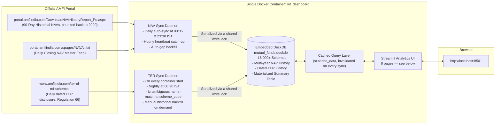

# 🇮🇳 Indian Mutual Funds Analytics Dashboard (Official AMFI + DuckDB + Streamlit)

A high-performance financial analytics platform for Indian Mutual Fund investors. It ingests data directly from the official **Association of Mutual Funds in India (AMFI)** portal — no third-party APIs, no subscription fees — and provides full historical NAV tracking, institutional-grade risk analytics, portfolio backtesting, and cross-fund comparison across 16,000+ schemes.

---

## ⚡ Key Highlights & Architecture

- **100% Official AMFI Data**: Direct integration with `portal.amfiindia.com` (daily closing NAV feed + 90-day historical reports, chunked back to 2020+ via the backfill engine) and with `www.amfiindia.com/ter-of-mf-schemes` (the official, dated SEBI Regulation 66 expense-ratio disclosure).
- **Embedded DuckDB Storage**: Zero standalone database server required. A single `fetcher/data/mutual_funds.duckdb` file holds the full scheme universe, multi-year NAV history, and dated TER history.
- **Live, Seamless Sync**: Two independent background sync loops. NAV: auto-syncs closing NAVs daily (00:05 IST and 23:30 IST) with an hourly heartbeat catch-up and automatic multi-day gap backfill. TER: auto-syncs the official AMFI TER-disclosure portal on every container start and nightly at 00:20 IST, matching schemes by an unambiguous normalized-name check and promoting them straight to official, dated status. A shared write lock serializes every writer (both daemons, manual "Sync Now" clicks, backfills, imports) so nothing ever races. Every read query is cached and the cache is invalidated automatically the instant new data lands — no stale numbers, no manual refresh needed.
- **Strict 4-Decimal Precision**: Every NAV, percentage, and return formatted to 4 digits after the dot (e.g., `₹ 123.4567` and `+12.3456%`).
- **Source-Aware Cost Data**: TER and exit-load figures are only ever shown when backed by a dated, scheme-code-keyed official record — never inferred from a category or scheme name. TER now reaches that bar automatically for most active schemes via the AMFI TER-portal sync; exit-load still requires a manual dated import (see [TER and Exit-Load Data Integrity](#-ter-and-exit-load-data-integrity) below).
- **One Shared Design System**: A single `theme.py` module provides consistent, theme-aware (light/dark) styling, KPI cards, and status banners across every page instead of per-page duplicated CSS.

---

## 🏛 Architecture Diagram



---

## 🚀 Quick Start (Windows 11)

### 1. Launch with PowerShell
```powershell
.\start.ps1
```
Or double-click `start.bat`.

The script will launch the container and automatically open:
👉 **[http://localhost:8501](http://localhost:8501)**

---

## 🧾 TER and Exit-Load Data Integrity

NAV history is official AMFI data, but on its own it does not include TER or scheme-specific exit-load terms.

**TER** now has its own official, automated source: AMFI separately publishes a daily, dated Total Expense Ratio disclosure
(SEBI Mutual Funds Regulations, 2026, Regulation 66) at
[`amfiindia.com/ter-of-mf-schemes`](https://www.amfiindia.com/ter-of-mf-schemes) — a full Base Expense Ratio / Brokerage
Cost / Transaction Cost / Statutory Levies breakdown for both the Direct and Regular plan of every actively-disclosing
scheme. `amfi_ter_client.py` fetches it and `amfi_sync.sync_official_ter()` matches it to local schemes by the exact same
unambiguous normalized-name discipline `costs_data.py` already applied to the bundled legacy CSV (see
`costs_data.normalize_scheme_name`) — a name is only accepted if it resolves to exactly one scheme on both AMFI's side and
ours. A matched scheme is promoted straight to **official, dated** status, its full daily history is retained in the
`ter_history` table, and its latest value is cached onto `schemes` for fast reads — automatically, going forward, with zero
manual steps. This runs on every container start and nightly at 00:20 IST (current month only); a manual "Backfill Last 12
Months" / "Backfill Since FY2018-19" action on the Data Management page reaches further back on demand.

- Only a scheme the automated match **can't** confidently place still falls back to the bundled `fetcher/data/amfi_ter_data.csv` — a **legacy, unverified name match** with no recorded source URL or effective date, never presented as current official TER.
- The dashboard still does **not** infer TER from a category, or exit load from a scheme name. Unknown fields remain unavailable.
- **Exit-load** has no equivalent official feed anywhere — it stays unavailable until you import a dated, scheme-code-keyed record from **⚡ Data Management → Official TER & Exit-Rule Import**, which still requires its own as-of date and official AMFI/AMC URL.
- Exit-load payout calculations require the investor's actual purchase lots, redemption units, redemption date, and an official rule schedule. A chart date range is only a performance window and is never used as a holding period.
- NAV performance is already net of TER. A current TER supports an illustrative current-rate estimate; reconstructing a historical fee is only possible for the window a scheme has actually been dated-TER-synced (`ter_history`), never before it.
- The **Portfolio Backtest** tab (below) follows the same policy: rebalancing is simulated frictionlessly, with no invented transaction cost, exit load, or capital-gains tax figure.

---

## 📊 Dashboard Pages

### 1. Overview (`Overview.py`)
Market-wide command center: tracked-universe KPIs, market breadth, top/lagging performers, macro asset-class performance and indexed trajectory (Equity/Debt/Hybrid), and an AMC league table.

### 2. Scheme Screener
Full-universe screener across 16,000+ schemes with independent filters (AMC, Asset Class, Category, Plan, Option, Max TER), live keyword/AMFI-code search, single-scheme isolation, a performance trajectory chart, and a sortable, CSV-exportable results table.

### 3. Compare & Simulate
A single fund-selection panel (up to 6 schemes) feeds two tabs. **Head-to-Head Comparison**: side-by-side metrics table, ₹-growth and normalized % return charts, nominal NAV trajectory, and cost/redemption-readiness context — explicitly flags schemes with no data or a later start date in the active window instead of silently dropping them. **Portfolio Backtest**: turns the same selected funds into a weighted portfolio and runs a SIP or lump-sum backtest with optional monthly/quarterly/annual rebalancing, built entirely on official AMFI NAV history. Reports both the money-weighted return (XIRR — what the actual investor experienced) and the time-weighted return (CAGR/Sharpe/Max Drawdown of the underlying strategy, independent of contribution timing), plus an allocation-drift chart and per-fund breakdown.

### 4. Leaders & Laggards
Category-relative alpha leaderboards (vs. true peer-category median), a risk-reward 4-quadrant matrix, absolute return momentum, category rotation heatmap, and a laggard diagnostic engine that distinguishes cyclical dips from structural underperformance. Funds with too little trading history in the active window are excluded from ranking rather than skewing it.

### 5. Quantitative MF Analysis
Institutional single-fund analytics: Sharpe, Sortino, Calmar, VaR/CVaR, skewness/kurtosis, CAPM regression (Beta, Jensen's Alpha, R², Tracking Error, Information Ratio, Treynor, Up/Down Market Capture) against a synthesized category benchmark, a Nifty 50 proxy, or a custom peer fund, rolling risk dynamics, and a Monte Carlo (GBM) forward simulation. Benchmark unavailability is always surfaced explicitly rather than silently defaulting to a misleading number.

### 6. Data Management
Database telemetry, on-demand "Sync Now", summary-table recompute, the multi-year historical backfill engine (2020–present, chunked into 89-day AMFI requests), and the official TER/exit-rule CSV importer.

### 7. Portfolio Suggestion
Risk-profiled, budget-aware model-portfolio construction — educational and rules-based, never personalized advice. A behavioral risk questionnaire (or a quick 5-tier selector) sets a risk tier, which maps to a disclosed strategic asset-allocation table across six sleeves (Equity Core, Equity Satellite, International Equity, Debt, Gold, Liquid Buffer). Two independent, side-by-side construction methods: a transparent weighted quality score (Sharpe/Sortino/category-relative alpha/max drawdown/TER) picking the best real candidate per sleeve, and a mean-variance (max-Sharpe, long-only, `scipy.optimize`) allocation across that same screened candidate set. Both feed the existing `portfolio_sim.run_backtest()` engine for a full historical backtest, and both show a "Why this fund?" breakdown per pick.

---

## 🛠 Useful Commands

| Action | Command |
| :--- | :--- |
| **Start Dashboard** | `docker compose up -d` |
| **View Live Logs** | `docker compose logs -f` |
| **Stop Dashboard** | `docker compose down` |
| **Trigger Daily Sync via CLI** | `docker compose exec dashboard python -c "import amfi_sync; print(amfi_sync.sync_daily_nav())"` |
| **Trigger TER Sync via CLI** | `docker compose exec dashboard python -c "import amfi_sync; print(amfi_sync.sync_official_ter())"` |
| **Check Database Stats** | `docker compose exec dashboard python -c "import db; print(db.get_database_stats())"` |
| **Run Unit Tests** | `docker compose exec dashboard python -m unittest test_costs_data.py` |

---

## 📁 Project Structure

```
indian-mutual-funds/
├── docker-compose.yml          # Single-service Streamlit + DuckDB compose file
├── start.ps1                   # Windows 11 PowerShell one-click launcher
├── start.bat                   # Windows batch launcher
├── README.md                   # System documentation
└── fetcher/
    ├── Dockerfile              # Python 3.11 container image
    ├── requirements.txt        # Streamlit, DuckDB, Plotly, Pandas, etc.
    ├── Overview.py             # Streamlit entrypoint & market overview
    ├── theme.py                # Shared design system: CSS, KPI cards, banners, tooltips
    ├── db.py                   # DuckDB query/caching layer, write-lock, data-version tracking
    ├── quant_analytics.py      # Institutional risk/return metrics (Sharpe, Sortino, VaR, Alpha/Beta)
    ├── portfolio_sim.py        # Multi-fund SIP/lump-sum backtest engine (XIRR + TWR)
    ├── portfolio_advisor.py    # Risk-tiered model-portfolio construction (rules-based + mean-variance)
    ├── date_picker.py          # Unified calendar date range picker & live-sync watcher
    ├── filter_state.py         # Session-scoped filter persistence & widget-state sanitizer
    ├── costs_data.py           # Source-aware TER / exit-load handling (never inferred)
    ├── amfi_client.py          # Official AMFI NAV portal scraper & parser
    ├── amfi_ter_client.py      # Official AMFI TER-portal API client (Regulation 66 disclosure)
    ├── amfi_sync.py            # Daily & historical AMFI + TER synchronizer (write-lock serialized)
    ├── test_costs_data.py      # Unit tests for costs_data.py
    ├── pages/                  # Numbered filenames control sidebar nav order (Streamlit auto-discovery)
    │   ├── 1_Scheme_Screener.py
    │   ├── 2_Compare_&_Simulate.py
    │   ├── 3_Leaders_&_Laggards.py
    │   ├── 4_Quantitative_MF_Analysis.py
    │   ├── 5_Data_Management.py
    │   └── 6_Portfolio_Suggestion.py
    └── data/
        └── mutual_funds.duckdb  # Embedded DuckDB database (official AMFI data)
```
