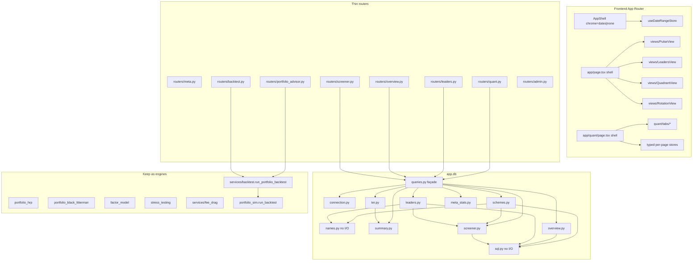
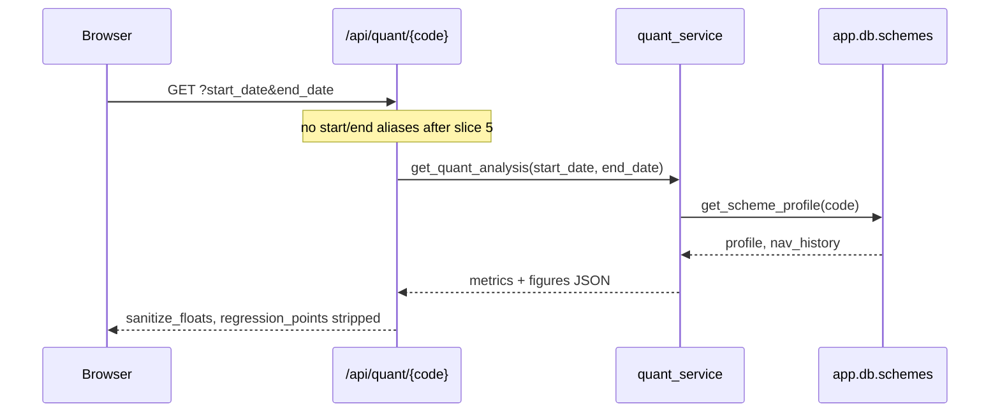

# MyFinonce Maintainability Refactoring

| Field | Value |
| --- | --- |
| **Author** | TBD |
| **Date** | 2026-09-21 |
| **Status** | Draft |
| **Repo** | https://github.com/msaij/MyFinonce |
| **Baseline** | `main` @ `a2d6176` (working tree clean) |
| **Audience** | Senior engineers who already know this codebase |

---

## Overview

MyFinonce is a working, tested Indian mutual-fund analytics stack: FastAPI (`backend/app`) + Next.js 14 App Router (`frontend`) + Postgres 16 in Docker Compose, project name pinned to `indian-mutual-funds`. The product is a Streamlit port with engines bolted onto giant files. A maintainability review **did not approve** further product work on `backend/app/db/queries.py` or `frontend/app/quant/page.tsx` until the first refactor slices land.

This design turns that review into a behavior-preserving, incrementally mergeable refactor. The work is mechanical extraction, contract collapse, and dead-path deletion — not a rewrite, not a new framework, and not new product features except PR 11 (ship the Black-Litterman tab; delete unused `HOLDOUT_PORTFOLIOS`). Each PR is independently reviewable, keeps HTTP and SQL results identical, and moves tests with the code.

Review sequence vs PRs (live in this table, not in “Slice n”):

| Review step | Slice | PR |
| --- | --- | --- |
| Extract period-return SQL | 1a | **PR 1** |
| Split `queries.py` by domain | 1b | **PR 2** — lifts the `queries.py` product freeze |
| Split `/quant` tabs; optional AppShell chrome | 2a + 2b | **PR 3** — lifts the `quant/page.tsx` product freeze |
| Overview four views | 2c | **PR 4** — no freeze; optional relative to 2a |
| NAV merge stops writing TER | 3 | **PR 5** |
| One backtest orchestrator | 4 | **PR 6** |
| One date-query contract on `/api/quant` | 5 | **PR 7** |
| Compare TER drag on the server | later | **PR 8** — not freeze-critical |
| Typed per-page stores; kill unknown bag last | 6 | **PR 9** then **PR 10** |

---

## Background & Motivation

### Current state

The backend is FastAPI with thin routers for meta / overview / screener / admin, a fat query module, and several engine modules that are already the right shape (`portfolio_hrp.py`, `portfolio_black_litterman.py`, `factor_model.py`, `stress_testing.py`, `services/fee_drag.py`). The frontend is Next.js 14 App Router, Zustand + persist, TanStack Query, and Plotly figures rendered as JSON via `PlotlyChart`.

Compose is load-bearing:

- Project name is pinned to `indian-mutual-funds` so the named volume stays `indian-mutual-funds_pgdata` (~27M `nav_history` rows). An unpinned name would create empty `myfinonce_pgdata`.
- Backend is bind-mounted (`./backend:/app`); Python changes are live. Frontend is a production image; UI changes require `docker compose up -d --build frontend`.
- Tests run **only** in Docker (no host Python): `docker exec mf_backend pytest …` and `docker exec mf_frontend npm test`.

### Pain points (from the review, verified in tree)

1. **`backend/app/db/queries.py` is 2032 physical lines** and owns NAV split normalization, `summary_table` rebuild, `init_db` + cost rewrite, screener WHERE/KPIs/table, overview stats/category matrix/macro trend, leaders/gainers-losers, scheme profile + TER upsert, `sync_meta`, and data quality. The first/last-NAV-in-window LATERAL join is copy-pasted **six times** in this file (a seventh lives in `portfolio_advisor.get_sleeve_candidates`, deferred to PR 14). The module docstring is a 47-line SQLite→Postgres essay that belongs in `connection.py` (already has the lineage) or git history.

2. **Frontend files past/near 1k lines**, all `"use client"` pages that mix data fetching, URL sync, and panel JSX (physical line counts at `a2d6176`; tab cut points below are line numbers, not file sizes):
   - `frontend/app/quant/page.tsx` — 1125 lines, 10 tabs, 12+ `useState`s, 6 queries
   - `frontend/app/page.tsx` — 1000 lines, Overview + leaders + quadrant + rotation; local `PillRadio`/`Select`
   - `frontend/app/portfolio/page.tsx` — 959 lines
   - `frontend/app/compare/page.tsx` — 710 lines, client-side TER-drag clone
   - `frontend/components/shared/DataTable.test.tsx` — 1024 lines vs `DataTable.tsx` 687

3. **`AppShell` always mounts `DateRangePicker`.** Admin does not use plan/option/window. Portfolio uses its own 3Y construction / 1Y holdout dates and Direct-only methodology. Shared chrome lies. Three clocks exist: `useDateRangeStore` (`mf-date-range`), `useFilterStore` bag of `unknown` (`mf-filters`), and portfolio’s `fitStart`/`fitEnd`/`testStart`/`testEnd`. `getFilter` is `value as any`.

4. **Dead / dual contracts:** `get_scheme_cost_specs` ignores all args and always returns unknown TER, yet is still called from `amfi_sync._scheme_rows` and `init_db`. `/api/quant/{code}` accepts `start_date`/`end_date` **and** `start`/`end`. Two backtest orchestrators wrap the same `portfolio_sim.run_backtest`. Compare clones `costs_data.estimate_current_ter_drag` in TypeScript. `BL_UI=false` / `HOLDOUT_PORTFOLIOS=false` hide shipped UI.

5. **Layer confusion:** quant analysis is split across `routers/quant.py` (factors/stress/tail/fee-drag composed inline), `services/quant_service.py` (Plotly mixed with analysis — this is intentional per the migration plan), `quant_analytics.py` (944), `quant_intelligence.py`, and engines. `portfolio_advisor.py` (743) mixes sleeve SQL, scoring, MVO, and backtest. `amfi_sync.py` (1008) is NAV + TER + daemon + two backfill workers.

The product works and is tested. The problem is that the next feature on `queries.py` or `quant/page.tsx` will be unreviewable.

---

## Goals & Non-Goals

### Goals

- Make the review’s suggested changes **implementable**: what to change, why, in what order, what not to touch, how to keep behavior identical.
- Shrink the freeze files (`queries.py`, `quant/page.tsx`) so later product work has a place to land.
- Preserve every load-bearing invariant listed under **Keep**.
- Ship incremental PRs, each green in Docker, each independently mergeable.
- Move tests with the code. `from app.db import queries as db` must keep working until a dedicated follow-up deletes the façade.

### Non-goals

- New product features, new metrics, new charts, new API resources (except the minimum needed to delete a duplicated client formula or a dead flag).
- Rewriting Next.js App Router, introducing a new UI kit, or replacing Zustand / TanStack Query / Plotly.
- Splitting `DataTable.tsx` / `DataTable.test.tsx` (size noted; not a freeze blocker).
- Splitting `portfolio/page.tsx` beyond chrome (later, optional).
- Changing SQL dialect, indexes, `summary_table` schema, or NAV split math.
- Host Python, Alembic rewrite, or moving off the named Postgres volume.
- Unifying `start` vs `start_date` on **non-quant** endpoints (`/api/screener`, `/api/leaders`, `/api/schemes/nav-history` already use `start`/`end` as their canonical names). That is a different contract and out of this design’s scope.

### Freeze

Until **PR 1 and PR 2** merge: **no new product features in `backend/app/db/queries.py`.** (PR 1 extracts the SQL helper; PR 2 is the split that lifts this freeze.)

Until **PR 3** (`/quant` tab split + AppShell chrome) merges: **no new product features in `frontend/app/quant/page.tsx`.**

PR 4 (Overview views) does **not** lift a freeze. Bugfixes in freeze files are allowed if they are the smallest possible patch and do not add surface.

---

## Proposed Design

### Target module map



### Slice 1 — One period-return SQL, then split `queries.py`

#### 1a. Extract the duplicated LATERAL join

Six copies of the same first/last NAV window join exist in `backend/app/db/queries.py`. The SQL is byte-identical except for the selected columns and the alias of the computed return (`period_return_pct` vs `return_pct`):

| # | Function | Approx. lines | Alias |
| --- | --- | --- | --- |
| 1 | `get_kpis` `sql_combined` / `period_calc` | 871–889 | `period_return_pct` |
| 2 | `get_screener_dataframe` date-window branch | 1129–1149 | `period_return_pct` |
| 3 | `get_gainers_losers` `sql_gainers` | 1341–1357 | `return_pct` |
| 4 | `get_gainers_losers` `sql_losers` | 1369–1385 | `return_pct` |
| 5 | `get_advanced_leaders_dataframe` `scheme_perf` | 1509–1528 | `period_return_pct` |
| 6 | `get_advanced_leaders_dataframe` `cat_median_sql` | 1556–1573 | `period_return_pct` |

The expression:

```sql
CASE
    WHEN ps.nav IS NULL OR ps.nav <= 0 THEN NULL
    ELSE ROUND((((COALESCE(pe.nav, s.latest_nav) - ps.nav) / NULLIF(ps.nav, 0) * 100.0))::numeric, 4)::double precision
END
```

The joins (aliases `ps` = period start = earliest NAV in `[start, end]`; `pe` = period end = latest NAV in `[start, end]`):

```sql
LEFT JOIN LATERAL (
    SELECT nav, nav_date FROM nav_history
    WHERE scheme_code = s.scheme_code AND nav_date >= %s AND nav_date <= %s
    ORDER BY nav_date ASC
    LIMIT 1
) ps ON TRUE
LEFT JOIN LATERAL (
    SELECT nav, nav_date FROM nav_history
    WHERE scheme_code = s.scheme_code AND nav_date >= %s AND nav_date <= %s
    ORDER BY nav_date DESC
    LIMIT 1
) pe ON TRUE
```

Add `backend/app/db/sql.py` (new, ~80 lines, no DB I/O):

```python
PERIOD_RETURN_SQL = """
CASE
    WHEN ps.nav IS NULL OR ps.nav <= 0 THEN NULL
    ELSE ROUND((((COALESCE(pe.nav, s.latest_nav) - ps.nav) / NULLIF(ps.nav, 0) * 100.0))::numeric, 4)::double precision
END
"""

NAV_WINDOW_JOINS = """
LEFT JOIN LATERAL (
    SELECT nav, nav_date FROM nav_history
    WHERE scheme_code = s.scheme_code AND nav_date >= %s AND nav_date <= %s
    ORDER BY nav_date ASC
    LIMIT 1
) ps ON TRUE
LEFT JOIN LATERAL (
    SELECT nav, nav_date FROM nav_history
    WHERE scheme_code = s.scheme_code AND nav_date >= %s AND nav_date <= %s
    ORDER BY nav_date DESC
    LIMIT 1
) pe ON TRUE
"""

def nav_window_params(start_date, end_date):
    """Four placeholders matching NAV_WINDOW_JOINS: ps start/end, pe start/end."""
    return [start_date, end_date, start_date, end_date]

def where_active_as_of(where_sql: str) -> str:
    """Append 'latest_date >= %s' without breaking an empty WHERE."""
    extra = "AND s.latest_date >= %s" if where_sql else "WHERE s.latest_date >= %s"
    return f"{where_sql} {extra}".strip()
```

**Param-order invariant (do not invent a generic binder).** Two shapes, not one:

**Shape A — KPIs, screener, both gainers/losers queries, and leaders `cat_median_sql` (line 1582):**

```python
# nav_window_params + WHERE params + as-of date
all_p = nav_window_params(start_date, end_date) + params + [start_date]
# cat_median is the same shape with the category-only WHERE:
cat_median_params = nav_window_params(start_date, end_date) + params_cat + [start_date]
```

**Shape B — leaders `scheme_perf` only (line 1536).** Unique. Copy byte-for-byte:

```python
# matching-schemes WHERE + as-of, then vol window, then two NAV-window pairs, then outer where_sql_active again
all_p = params + [start_date] + [vol_start, end_date, start_date, end_date, start_date, end_date] + params + [start_date]
```

Do **not** apply Shape B to `cat_median` (that would bind vol-window dates into the NAV joins). Put a one-line comment at each of the two `get_advanced_leaders_dataframe` call sites naming the shape. `test_cat_median_sql_plan_type_filtered_branch` is the dedicated guard for Shape A inside leaders.

Call-site change (example, `get_kpis`):

```python
from app.db.sql import PERIOD_RETURN_SQL, NAV_WINDOW_JOINS, nav_window_params, where_active_as_of

where_sql_active = where_active_as_of(where_sql)
sql_combined = f"""
    WITH period_calc AS (
        SELECT s.scheme_name, s.broad_category, s.category,
               {PERIOD_RETURN_SQL} as period_return_pct
        FROM summary_table s
        {NAV_WINDOW_JOINS}
        {where_sql_active}
    ),
    ...
"""
all_p = nav_window_params(start_date, end_date) + params + [start_date]
```

Also move the date helpers that every domain needs into `sql.py` (they are not SQL strings, but they are the other copy-paste tax):

- `_parse_date` (queries.py:805)
- `_normalize_date_range` (queries.py:831) — auto-swaps if start > end; tests in `test_normalize_date_range_flexible_formats` and `test_inverted_date_range_normalization` lock this
- `_configure_parallel_planner` (queries.py:97) — no longer imported by any test (the live-database SLA suites that imported it were retired on 2026-09-22), so it can move without a re-export.

Move `_build_screener_where` (queries.py:985) with the screener module in 1b, not in 1a. Callers of `_build_screener_where` are `get_kpis`, `get_screener_dataframe`, **and** `get_gainers_losers` / `get_advanced_leaders_dataframe` **and** `get_schemes_for_dropdown`. 1a only extracts SQL/date helpers.

**Seventh LATERAL (out of PR 1 scope):** `portfolio_advisor.get_sleeve_candidates` (`portfolio_advisor.py:236–261`) is a seventh production copy of the same CASE + first/last NAV LATERAL, plus a third LATERAL for first-ever NAV. Join text is not byte-identical (`SELECT nav` vs `SELECT nav, nav_date`). PR 1 acceptance `rg "LEFT JOIN LATERAL" backend/app/db` will pass while this copy remains. **Defer reuse of `PERIOD_RETURN_SQL` / `NAV_WINDOW_JOINS` to PR 14.** Do not let PR 1 “generic binder” zeal touch that bind list: `cat_params + [active_start, active_end] × 3 + track_record_cutoff`.

**Acceptance for 1a:** `docker exec mf_backend pytest tests/ -q` is green (this PR touches `queries.py`). `rg "LEFT JOIN LATERAL" backend/app/db` shows the join in `sql.py` only; the advisor copy is documented as remaining until PR 14.

#### 1b. Split `queries.py` by domain; keep a thin re-export

`backend/app/db/__init__.py` is empty. Do **not** move the public import path to the package. 30+ call sites use `from app.db import queries as db` (routers, `amfi_sync`, `main.py` startup `db.init_db()`, `conftest.py`, `test_db_queries.py`). `queries.py` becomes an explicit re-export façade.

Target files (names match the review):

| New module | Functions to move | Approx. lines today |
| --- | --- | --- |
| `db/sql.py` | `PERIOD_RETURN_SQL`, `NAV_WINDOW_JOINS`, `nav_window_params`, `where_active_as_of`, `_parse_date`, `_normalize_date_range`, `_configure_parallel_planner` | new, no I/O |
| `db/names.py` | `format_scheme_display_name` | new, no I/O (used by schemes **and** leaders) |
| `db/summary.py` | `_SPLIT_FACTORS`, `_is_clean_split_ratio`, `normalize_nav_splits`, `_normalize_nav_splits_impl`, `refresh_summary_table`, `_refresh_summary_table_impl`, `init_db` | ~500 |
| `db/screener.py` | `_build_screener_where`, `get_kpis`, `get_screener_dataframe`, alias `get_screener_data` | ~370 |
| `db/overview.py` | `get_amcs`, `get_broad_categories`, `get_subcategories`, `get_options_list`, `get_plans_list`, `get_market_overview_stats`, `get_category_performance_matrix`, `get_macro_asset_class_trend` | ~210 |
| `db/leaders.py` | `get_gainers_losers`, `get_advanced_leaders_dataframe`, alias `get_leaders_laggards` | ~340 |
| `db/schemes.py` | `get_schemes_for_dropdown`, `get_nav_history_dataframe`, `get_scheme_profile`, `get_scheme_profile_only`, `get_scheme_identity_map` | ~150 |
| `db/ter.py` | `get_scheme_ter_history`, `upsert_ter_history`, `_upsert_ter_history_impl`, `apply_latest_official_ter`, `_apply_latest_official_ter_impl`, `get_cost_data_coverage` | ~160 |
| `db/meta_stats.py` | `_redacted_dsn`, `_STATS_CACHE` / `_STATS_CACHE_TIME` / `_STATS_CACHE_TTL`, `invalidate_database_stats_cache`, `get_database_stats`, `get_sync_meta_values`, `set_sync_meta_value`, `get_data_quality` | ~180 |

#### Import DAG (PR 2 must follow this; no cycles)

```
sql.py          # no I/O
names.py        # no I/O: format_scheme_display_name
connection.py   # already exists; get_connection, WRITE_LOCK, fetchdf, …

screener.py     # sql, connection
                # _build_screener_where used by get_kpis, get_screener_dataframe,
                # AND get_gainers_losers, get_advanced_leaders_dataframe,
                # AND get_schemes_for_dropdown
overview.py     # sql (_normalize_date_range — get_macro_asset_class_trend is
                # NOT a LATERAL query), connection
leaders.py      # sql, screener._build_screener_where, names
schemes.py      # sql, screener._build_screener_where, names
                # get_schemes_for_dropdown keeps using _build_screener_where
summary.py      # connection, costs_data (until PR 5). MUST NOT import ter.py
ter.py          # connection; imports refresh_summary_table from summary
                # (module-level or function-local). One-way: ter → summary
meta_stats.py   # connection; owns the stats TTL cache globals
queries.py      # façade: re-exports connection helpers + all domain publics
```

`backend/app/db/__init__.py` stays empty. Public path remains `app.db.queries`.

`get_schemes_for_dropdown` (queries.py:1237) **keeps** calling `_build_screener_where`. `format_scheme_display_name` is also called from `get_nav_history_dataframe`, `get_gainers_losers`, and `get_advanced_leaders_dataframe` — hence `names.py`, not “lives in leaders.py”.

`init_db` currently (queries.py:509–598) also runs the cost-data-version rewrite via `costs_data.get_scheme_cost_specs`. Leave that loop **in place** during 1b; PR-5 deletes it. Splitting must not change `init_db` behavior.

`refresh_summary_table` is called from `normalize_nav_splits`’s callers, `init_db`, TER apply, and `amfi_sync` after merges. Keep the `WRITE_LOCK` wrapper in `summary.py`. Other modules import `refresh_summary_table` from `app.db.summary`, not via a circular `queries` import.

**Façade** (`queries.py` after 1b, explicit, no `import *`). Compatibility re-exports of connection helpers are **required**: `amfi_sync.py` uses `db.get_connection()` and `with db.WRITE_LOCK:` on the merge, both backfill workers, and `sync_daily_nav`; `portfolio_advisor.py:207` uses `db.get_connection()` in sleeve SQL. Omitting them is an `AttributeError` on the first NAV merge and on `/portfolio-advisor/suggest`. Audit before merging PR 2: `rg "db\\.(get_connection|WRITE_LOCK)" backend`. New code imports `app.db.connection` directly.

```python
"""Compatibility façade. Prefer app.db.<domain> for new code."""
# Compatibility re-exports — new code imports app.db.connection.
from app.db.connection import get_connection, WRITE_LOCK
from app.db.sql import _configure_parallel_planner, _normalize_date_range, _parse_date
from app.db.names import format_scheme_display_name
from app.db.summary import init_db, normalize_nav_splits, refresh_summary_table
from app.db.screener import get_kpis, get_screener_dataframe, get_screener_data
from app.db.overview import (
    get_amcs, get_broad_categories, get_subcategories,
    get_options_list, get_plans_list,
    get_market_overview_stats, get_category_performance_matrix,
    get_macro_asset_class_trend,
)
from app.db.leaders import (
    get_gainers_losers,
    get_advanced_leaders_dataframe, get_leaders_laggards,
)
from app.db.schemes import (
    get_schemes_for_dropdown, get_nav_history_dataframe,
    get_scheme_profile, get_scheme_profile_only, get_scheme_identity_map,
)
from app.db.ter import (
    get_scheme_ter_history, upsert_ter_history, apply_latest_official_ter,
    get_cost_data_coverage,
)
from app.db.meta_stats import (
    invalidate_database_stats_cache, get_database_stats,
    get_sync_meta_values, set_sync_meta_value, get_data_quality,
)

__all__ = [
    "get_connection", "WRITE_LOCK",
    "_configure_parallel_planner", "_normalize_date_range", "_parse_date",
    "format_scheme_display_name",
    "init_db", "normalize_nav_splits", "refresh_summary_table",
    "get_kpis", "get_screener_dataframe", "get_screener_data",
    "get_amcs", "get_broad_categories", "get_subcategories",
    "get_options_list", "get_plans_list",
    "get_market_overview_stats", "get_category_performance_matrix",
    "get_macro_asset_class_trend",
    "get_gainers_losers", "get_advanced_leaders_dataframe", "get_leaders_laggards",
    "get_schemes_for_dropdown", "get_nav_history_dataframe",
    "get_scheme_profile", "get_scheme_profile_only", "get_scheme_identity_map",
    "get_scheme_ter_history", "upsert_ter_history", "apply_latest_official_ter",
    "get_cost_data_coverage",
    "invalidate_database_stats_cache", "get_database_stats",
    "get_sync_meta_values", "set_sync_meta_value", "get_data_quality",
]
```

No other `connection.py` names (`bump_data_version`, `get_data_version`, `DATABASE_URL`, `fetchdf`) are reached as `db.*` today; do not re-export them unless the audit finds a new caller.

**Do not rewrite routers in 1b.** They keep `from app.db import queries as db`. A later optional PR can point routers at domain modules; it is not required for maintainability of the query file.

**Tests that must keep importing `app.db.queries`:**

- `backend/tests/test_db_queries.py` — 30 tests, `from app.db import queries as db`; also `test_query_aliases_exist` asserts `db.get_screener_data is db.get_screener_dataframe` and `db.get_leaders_laggards is db.get_advanced_leaders_dataframe`
- `backend/tests/conftest.py`
- Every other `from app.db import queries as db` listed in the grep (routers, `amfi_sync`, `main.py`, `test_api_quant.py`, `test_quant_service.py`, `test_amfi_sync_merge.py`, …)

Optionally add `backend/tests/test_db_sql.py` with one assertion: interpolating `PERIOD_RETURN_SQL` + `NAV_WINDOW_JOINS` into a dummy `SELECT` produces the same string the old functions used (golden snippet). Not required if `test_db_queries.py` still covers numeric results.

**Docstring:** drop the 47-line dialect essay from the façade. One sentence + pointer to `app.db.connection` is enough. The dialect notes are already true of the whole package, not of `queries.py`.

**Acceptance for 1b:** `docker exec mf_backend pytest tests/ -q` green (touches `queries.py`). `queries.py` is the façade only. `db.get_connection` and `db.WRITE_LOCK` still work. No router diff except imports if a circular import forces one (should not).

### Slice 2 — Split `/quant` tabs; optional `AppShell` chrome; Overview four views

#### 2a. `/quant` page becomes a shell

Today `frontend/app/quant/page.tsx` (1125 physical lines) owns:

- Scheme picker + benchmark + RF rate toolbar
- 10 tabs: `intel`, `factors`, `stress`, `fees`, `tail`, `risk`, `drawdown`, `capm`, `rolling`, `montecarlo` (`TABS` at line 34)
- 12+ `useState`s seeded from URL + `useFilterStore` section `"quant"`
- `useUrlSync` of `scheme_code`, `tab`, `bench_mode`, `custom_peer_code`, `rf`, `scenario`, `shock_*`, `start`, `end`
- Six `useQuery` hooks: `getQuantAnalysis`, `getFactorAttribution`, `getStressTest`, `getMonteCarlo`, `getFeeDrag`, `getTailRisk`
- All panel JSX

Keep **already-extracted** widgets: `FactorWaterfallChart`, `FeeDragPanel`, `ScenarioStressSimulator`, `CorrelationHeatmap` under `frontend/components/quant/`. Do not inline them back.

New layout:

```
frontend/app/quant/page.tsx          # shell only (~250 lines)
frontend/app/quant/tabs/types.ts     # Tab, TAB_LABELS, QuantTabProps
frontend/app/quant/tabs/IntelTab.tsx
frontend/app/quant/tabs/FactorsTab.tsx
frontend/app/quant/tabs/StressTab.tsx
frontend/app/quant/tabs/FeesTab.tsx
frontend/app/quant/tabs/TailTab.tsx
frontend/app/quant/tabs/RiskTab.tsx
frontend/app/quant/tabs/DrawdownTab.tsx
frontend/app/quant/tabs/CapmTab.tsx
frontend/app/quant/tabs/RollingTab.tsx
frontend/app/quant/tabs/MonteCarloTab.tsx
```

Shell responsibilities (stay in `page.tsx`):

- `useSearchParams` + `useUrlSync` (same keys, same 300ms debounce)
- Scheme / peer / RF / tab state
- The six `useQuery` hooks with the **same `enabled` predicates** (factors fetch when tab is `factors|intel|stress`; stress when `stress|intel`; MC when `montecarlo` and `n_trading_days >= 60`; fee-drag when `fees|intel`; tail when `tail`)
- Toolbar JSX (SearchCombobox, bench select, RF input)
- Tab bar
- `AppShell`

Each tab receives a typed props object (analysis `result`, `factorsResult`, `stressResult`, etc., plus the shock state that `StressTab` needs). Do **not** move queries into tabs in the first pass — that would change fetch timing. Tabs are presentational + local UI (the stress sliders already live in `ScenarioStressSimulator`).

Tab cut points (current `activeTab === "..."` blocks):

| Tab | Starts ~line |
| --- | --- |
| intel | 416 |
| factors | 621 |
| stress | 752 |
| risk | 807 |
| drawdown | 877 |
| capm | 927 |
| rolling | 989 |
| fees | 1020 |
| tail | 1027 |
| montecarlo | 1045 |

**Behavior lock:** URL `?tab=factors` still works; default tab is still `"intel"` and is omitted from the URL (`useUrlSync` already drops it). Default scheme seed is still `getFilter("quant", "scheme_code", 119551)` until slice 6.

**Frontend tests:** there is no page-level quant test today. Existing widget tests under `frontend/components/quant/__tests__/` must still pass (`docker exec mf_frontend npm test`). Do not add a page test unless a tab extract accidentally drops a widget prop.

#### 2b. Optional chrome on `AppShell`

Today (`frontend/components/layout/AppShell.tsx`):

```tsx
export function AppShell({ children, pageContext }: { ... }) {
  // always mounts <DateRangePicker /> inside <Suspense>
}
```

`DateRangePicker` always writes `plan` / `option` / `preset` / `start` / `end` via `useUrlSync` and always polls `/api/meta/status` to drive `useDateRangeStore.syncBounds`. That is correct for Overview, Screener, Compare, Quant, and Scheme. It is a lie for:

- `/admin` — Data Management does not filter by plan/option/window
- `/portfolio` — uses construction/holdout dates (`fitStart`/`fitEnd`/`testStart`/`testEnd`) and Direct-only methodology; the page already tells the user “This page uses a 3Y construction / 1Y holdout window, not the global 90-day screener default.”

Change:

```tsx
export type Chrome = "dates" | "none";

export function AppShell({
  children,
  pageContext,
  chrome = "dates",
}: {
  children: React.ReactNode;
  pageContext?: PageContext;
  chrome?: Chrome;
}) {
  // header row + DateRangePicker only if chrome === "dates"
}
```

Call sites:

| Page | Chrome |
| --- | --- |
| `app/page.tsx` (Overview) | `"dates"` (default) |
| `app/screener/page.tsx` | `"dates"` |
| `app/compare/page.tsx` | `"dates"` |
| `app/quant/page.tsx` | `"dates"` |
| `app/scheme/[code]/page.tsx` | `"dates"` |
| `app/admin/page.tsx` | `"none"` |
| `app/portfolio/page.tsx` | `"none"` |

`app/leaders/page.tsx` is already `redirect("/?tab=leaders")` — no `AppShell`. Keep it.

**Do not** unmount `useDateRangeStore` globally. Portfolio/admin still sit inside `AppProviders`, which rehydrates both persisted stores. Sidebar still reads `preset/start/end/planType/optionType` from the date store — on admin/portfolio that will show the last analysis-page window, which is telemetry, not a control. Leave Sidebar as-is in this PR (changing it is product copy, not a contract).

**URL behavior change (intentional, tiny):** on `/admin` and `/portfolio`, `DateRangePicker` will no longer inject `plan`/`option`/`preset` into the URL. Portfolio already syncs its own keys (`fit_start`, `fit_end`, …). Admin has no date URL keys. Add a one-line note in the PR: bookmarking `/portfolio?plan=Direct` will stop round-tripping `plan` from chrome; Direct-only is methodology, not a chrome filter.

Existing store tests: `frontend/lib/stores/dateRange.test.ts`, `dateRangeStore.test.ts`. They do not mount `AppShell`. Still run `docker exec mf_frontend npm test`.

#### 2c. Overview: four tabs are four views

`frontend/app/page.tsx` (1000 physical lines) already admits `/?tab=leaders` (`MAIN_TABS`: `pulse`, `leaders`, `quadrant`, `rotation`; `frontend/app/leaders/page.tsx` redirects there). File size is not a reason to doubt the cut points below (rotation JSX starts ~987). Split:

```
frontend/app/page.tsx                    # shell: KPI bar, tab bar, useUrlSync, queries
frontend/app/overview/views/PulseView.tsx
frontend/app/overview/views/LeadersView.tsx
frontend/app/overview/views/QuadrantView.tsx
frontend/app/overview/views/RotationView.tsx
frontend/components/shared/PillRadio.tsx # currently local in page.tsx:29
frontend/components/shared/Select.tsx    # currently local in page.tsx:59
```

Keep queries in the shell on the first pass (same `enabled` / `placeholderData: keepPreviousData` behavior). `buildRotationFigure` stays in `frontend/lib/rotationChart.ts`. Cut points: pulse ~622, leaders ~721, quadrant ~940, rotation ~987.

Do this in the same PR as 2a only if the diff stays reviewable; otherwise land 2a+2b first and 2c immediately after. 2c does not unblock 2a.

### Slice 3 — NAV merge leaves TER columns alone

This is the review’s judo for dead contract #1.

#### What is wrong

`costs_data.get_scheme_cost_specs` (backend/app/costs_data.py:31) deletes all four arguments and always returns:

```python
{
    "expense_ratio": None,
    "ter_status": STATUS_UNKNOWN,          # "unknown"
    "ter_source": "No TER record matched by scheme code",
    "ter_source_url": None,
    "ter_as_of_date": None,
}
```

It is still called from:

1. `amfi_sync._scheme_rows` (amfi_sync.py:67) — every NAV merge (daily, 90d AMC, historical chunk) writes those unknown TER fields into `schemes`
2. `queries.init_db` (queries.py:542) — if `sync_meta.cost_data_version != COST_DATA_VERSION` (`source_aware_v2`), rewrite every non-official scheme to unknown

`SCHEME_UPDATE` (amfi_sync.py:40–59) already guards official rows:

```python
"expense_ratio": "CASE WHEN schemes.ter_status = 'official' THEN schemes.expense_ratio ELSE excluded.expense_ratio END",
# same pattern for ter_status, ter_source, ter_source_url, ter_as_of_date
```

So the merge path spends work to write `unknown` onto every non-official row, on every sync, and relies on the CASE to not clobber official TER. That is the opposite of “NAV merge leaves TER columns alone.”

Official TER is written only by `db.apply_latest_official_ter` ← `amfi_sync._sync_official_ter_impl`. Keep that path.

#### What to change

**`_scheme_rows`:** stop calling `get_scheme_cost_specs`. Drop TER columns from **both** `SCHEME_COLUMNS` and `SCHEME_UPDATE` in the same commit. `bulk.build_merge` raises `ValueError("update expressions for columns not being inserted: …")` if `SCHEME_UPDATE` keys are not in `SCHEME_COLUMNS` (`backend/app/db/bulk.py:172–174`).

```python
SCHEME_COLUMNS = [
    "scheme_code", "scheme_name", "fund_house", "category",
    "plan_type", "option_type", "isin",
]
# SCHEME_UPDATE: drop the five TER keys; keep fund_house/category blank-guards and isin COALESCE
```

New schemes inserted from NAV therefore have SQL NULL TER until the official TER sync fills them. That is the correct idle state (`STATUS_UNKNOWN` is a Python label; NULL `ter_status` already groups as `'unknown'` in `get_cost_data_coverage` via `COALESCE(ter_status, 'unknown')` and `IS NULL OR = 'unknown'` in `get_data_quality`; frontend uses `ter_status ?? "unknown"`).

**`init_db` cost block (queries.py:533–587) — remaining shape, not optional:**

1. `CREATE TABLE IF NOT EXISTS sync_meta (key TEXT PRIMARY KEY, value TEXT);`
2. `INSERT INTO sync_meta (key, value) VALUES ('cost_data_version', %s) ON CONFLICT (key) DO UPDATE SET value = excluded.value` with `costs_data.COST_DATA_VERSION` (`source_aware_v2`).
3. **No** `SELECT` of every scheme, **no** `get_scheme_cost_specs`, **no** `UPDATE schemes`.

Leaving `if version != COST_DATA_VERSION` with an empty body still table-scans `schemes`. Delete that scan. `test_init_db_does_not_clobber_official_ter` (`test_product_rev4.py`) forces `cost_data_version='force-rewrite'` then calls `init_db()`; it still passes if official rows are untouched.

**`get_scheme_cost_specs`:** after both production callers are gone, delete the function. Keep `normalize_scheme_name`, `STATUS_*`, `COST_DATA_VERSION`, `estimate_current_ter_drag`. Rewrite `tests/test_costs_data.py` stub tests as deletions (the function is gone).

#### Tests that must change (behavior of the dead path, not of official TER)

`tests/test_amfi_sync_merge.py`:

- **Keep** `test_merge_does_not_let_a_derived_ter_overwrite_an_official_one` — still the load-bearing precedence test. After this PR it becomes even stronger: NAV merge cannot write TER columns, so official rows cannot change even if `SCHEME_UPDATE` were buggy. Rewrite the assertion to: after a second NAV merge, `expense_ratio`/`ter_status`/`ter_source` remain the values written by the test’s manual `UPDATE`.
- **Replace** `test_merge_applies_fallback_ter_when_none_is_official`. That test stubs `get_scheme_cost_specs` to return `expense_ratio=1.25` / `ter_status='unverified'` and asserts the merge applied the fallback. The fallback is the thing we are deleting. New test: `test_merge_does_not_write_ter_columns` — insert a scheme via `_merge_amfi_payload`, assert `expense_ratio IS NULL` and `ter_status IS NULL`.
- Keep house/category blank-guard tests, idempotency, NAV restate.

`tests/test_db_queries.py` `test_init_db_creates_expected_tables` still passes (schema unchanged).

`tests/test_amfi_ter_client.py` (both regulatory eras) and `tests/test_amfi_sync_merge.py` (official TER never overwritten by a derived one) — official TER path; must stay green.

**Invariant to re-assert in the PR description:** official TER is never overwritten on NAV merge. This PR makes that structurally true (columns absent from the upsert), not just CASE-true.

### Slice 4 — One `run_portfolio_backtest`

Two orchestrators wrap `portfolio_sim.run_backtest` with the same lookback stitch:

| | `services/backtest.run_portfolio_backtest` | `portfolio_advisor.backtest_portfolio` |
| --- | --- | --- |
| File | `backend/app/services/backtest.py:31` | `backend/app/portfolio_advisor.py:595` |
| Callers | `routers/backtest.py` (Compare UI) | `routers/portfolio_advisor.py` lines 165, 170, 237 |
| Inputs | `scheme_codes`, `weights`, `mode`, amounts, `rebalance_freq`, dates | `weights` only, dates, `mode`, amounts; `rebalance_freq` defaults to `REBALANCE_QUARTERLY` |
| Mode map | `"SIP" if mode.startswith("SIP") else "Lump Sum"` | caller already mapped (`bt_mode` at portfolio_advisor router:140) |
| Missing funds | tracked as `missing_codes`, weights renormalized | silently dropped and renormalized |
| Returns | `normalized_weights`, `missing_codes`, `actual_start`, plus sim result | sim result only |

The lookback (10 calendar days before `actual_start`, last complete row as `lookback_row`) is copy-pasted. `pd.to_datetime` on `nav_date` is load-bearing (`test_backtest_service.py` exists because skipping it AttributeErrors on SIP + monthly rebalance).

**Collapse:** keep `services.backtest.run_portfolio_backtest` as the one orchestrator. Teach it a default `rebalance_freq` of `"None"` (compare’s request default) and accept `scheme_codes=None` meaning `list(weights)`. Move `df_hist["nav"] = df_hist["nav"].astype(float)` into the orchestrator (advisor does this today; the service does not).

`_serialize_backtest` (`routers/portfolio_advisor.py:128–135`) dumps the whole dict:

```python
bt = dict(bt)
df_result = bt.pop("df_result")
return sanitize_floats({**bt, "df_result": df_to_records(df_result), "sample": sample})
```

`run_portfolio_backtest` adds `normalized_weights`, `missing_codes`, `actual_start` on success. Today `backtest_portfolio` returns only the sim result. A naïve wrapper would grow `/api/portfolio-advisor/suggest` JSON. **Pop those three keys in the wrapper** so advisor HTTP is unchanged. Compare (`routers/backtest.py`) keeps the extra keys. Error-path serialize already returns only `error` + `sample`; errors are safe.

Implement this wrapper (not a sketch):

```python
def backtest_portfolio(
    weights: Dict[int, float],
    active_start: datetime.date,
    active_end: datetime.date,
    mode: str,
    lump_sum_amount: float,
    sip_amount: float,
    rebalance_freq: str = portfolio_sim.REBALANCE_QUARTERLY,
) -> Dict[str, Any]:
    from app.services.backtest import run_portfolio_backtest
    result = run_portfolio_backtest(
        scheme_codes=list(weights),
        weights=weights,
        mode=mode,
        lump_sum_amount=lump_sum_amount,
        sip_amount=sip_amount,
        rebalance_freq=rebalance_freq,
        start_date=active_start,
        end_date=active_end,
    )
    result.pop("missing_codes", None)
    result.pop("normalized_weights", None)
    result.pop("actual_start", None)
    return result
```

Keep the wrapper so `tests/test_product_rev4.py` (monkeypatches `app.portfolio_advisor.backtest_portfolio`) stays valid. Do not retarget those patches in this PR. **Do not change Compare’s HTTP body.** Advisor router already mapped `bt_mode = "SIP" if req.mode.startswith("SIP") else "Lump Sum"`; passing that string through is harmless even though the service maps again.

Advisor default `rebalance_freq=REBALANCE_QUARTERLY` vs compare default `"None"` is a real product difference. Preserve it via the wrapper’s default. Do not make Compare quarterly.

**Tests:** `tests/test_backtest_service.py` remains the SIP+rebalance regression. Add one advisor-path test (or extend product_rev4) that `backtest_portfolio` still returns a sim result with `df_result` for a two-fund lump sum and that the returned dict does **not** contain `missing_codes` / `normalized_weights` / `actual_start`. Numeric TWR/XIRR must match pre-PR on the synthetic fixture.

### Slice 5 — One date-query contract on `/api/quant`

`backend/app/routers/quant.py` accepts both pairs on four endpoints:

- `GET /api/quant/{scheme_code}`
- `GET /api/quant/{scheme_code}/monte-carlo`
- `GET /api/quant/{scheme_code}/factors`
- `GET /api/quant/{scheme_code}/tail-risk`

```python
start_date: Optional[datetime.date] = Query(None)
end_date: Optional[datetime.date] = Query(None)
start: Optional[datetime.date] = Query(None)
end: Optional[datetime.date] = Query(None)
actual_start = start_date or start
actual_end = end_date or end
```

**Why `start`/`end` exist:** `frontend/lib/api/quant.ts` `getFactorAttribution` maps JS `{ start, end }` to query params `start` / `end` (lines 331–345). `getQuantAnalysis`, `getMonteCarlo`, and `getTailRisk` already send `start_date` / `end_date`. The Quant page (`quant/page.tsx:179–183`) passes object keys `start` / `end` / `riskFreeRatePct` into that adapter. Changing the mapping **inside `quant.ts` is sufficient**; do not rename the page’s object keys in PR 7 (the page is freeze-frozen until PR 3).

**Decision (Option A):** drop the `start`/`end` *names* only. Keep today’s per-endpoint required-vs-default behavior:

| Endpoint | Dates omitted today | After PR 7 |
| --- | --- | --- |
| `GET /api/quant/{code}` | 422 required | still 422 (`start_date`/`end_date` required; message drops “or start and end”) |
| `GET /api/quant/{code}/monte-carlo` | 422 required | still 422 |
| `GET /api/quant/{code}/factors` | default today−3Y .. today | **keep the 3Y default** |
| `GET /api/quant/{code}/tail-risk` | default today−3Y .. today | **keep the 3Y default** |

Requiring dates on factors/tail-risk would 422 `test_quant_tail_risk.py` (bare `/factors` and `/tail-risk` expect 200; unknown scheme expects 404 — a dates-required check *before* profile lookup would 422 that 404), and would change the 422 *bodies* pinned by `test_api_quant.py::test_factors_window_errors_are_clear_422s` (“Insufficient trading days” / “No NAV records found”) into “Both start_date and end_date are required”. The Quant UI always has `start`/`end` from `useDateRangeStore` before it fetches (`enabled` requires both); the 3Y default is for tests and any external client. Behavior-preserving means keep it.

**Change:**

1. In `frontend/lib/api/quant.ts` only, `getFactorAttribution` sends `start_date` / `end_date` (object form and positional form). `page.tsx` stays on `{ start, end }`.
2. Drop `start` / `end` query params from the four quant endpoints.
3. Main + monte-carlo 422 message: `"Both start_date and end_date are required"`.
4. Factors / tail-risk: if `start_date`/`end_date` omitted, keep `today - 3Y .. today`. Profile 404 still runs before any date default (unknown scheme → 404, not 422).
5. `test_api_quant.py::test_factors_window_errors_are_clear_422s` already sends `start_date`/`end_date`, so the short-window and empty-window 422 bodies stay “Insufficient trading days” / “No NAV records found”. Do **not** retarget `test_quant_tail_risk.py` — it relies on the 3Y default.

**Do not** change `/api/screener` (`ScreenerFilters.start`/`end`), `/api/leaders` (`start`/`end`), or `/api/schemes/nav-history` (`start`/`end`). Those are consistent internally. Unifying the whole API is a later project.

Add `tests/test_api_quant.py::test_quant_main_rejects_start_end_aliases` — on `GET /api/quant/{code}`, `?start=&end=` without `start_date`/`end_date` → 422. Do not assert 422 for bare `/factors` (that stays 200 via the 3Y default).

Frontend rebuild required (`quant.ts` only).

### Slice 6 — Typed per-page stores; kill the unknown bag last

Today `frontend/lib/stores/filters.ts`:

```ts
getFilter: <T>(section: string, key: string, fallback: T) => T
// implementation: (value as any)
persist name: "mf-filters"
skipHydration: true  // load-bearing; see comment + AppProviders
```

Sections actually used:

| Section | Page | Keys |
| --- | --- | --- |
| `"quant"` | `app/quant/page.tsx` | `scheme_code`, `scheme_name`, `bench_mode`, `custom_peer_code`, `custom_peer_name`, `risk_free_rate_pct` |
| `"screener"` | `app/screener/page.tsx` | `amc`, `broad_cat`, `sub_cat`, `ter_label`, `sort_label`, `ascending`, `limit` |
| `"compare_simulate"` | `app/compare/page.tsx` | `selected_scheme_codes`, `investment_amount` |
| `"portfolio_weights"` | compare | per-scheme-code numbers |
| `"portfolio_config"` | compare | `mode`, `lump_sum_amount`, `sip_amount`, `rebalance` |
| `"portfolio_advisor"` | `app/portfolio/page.tsx` | `profile_mode`, `quick_tier`, `invest_mode`, `lump_sum_amount`, `sip_amount`, `horizon_years` |

`AppProviders` gates first paint on `useFilterStore.persist.rehydrate()` **and** `useDateRangeStore.persist.rehydrate()` because several pages seed `useState(() => getFilter(...))` once. Any replacement store must keep `skipHydration: true` and be listed in that `Promise.all`.

**Order (unknown bag last, as the review said):**

1. Add `frontend/lib/stores/quantFilters.ts` (typed). Read initial state from `mf-filters` section `quant` once (migration). Quant page switches. `mf-filters` still exists.
2. Same for screener, compare (three sections → one `CompareFiltersState`), portfolio.
3. Last PR: delete `useFilterStore`, stop rehydrating it in `AppProviders`, leave a one-time read of `localStorage["mf-filters"]` inside each new store’s `persist.merge` for one release, then delete the merge.

Do **not** put analysis dates in these stores. Dates stay in `useDateRangeStore`. Portfolio construction/holdout dates stay as URL + local state (already). Killing the date-store / filter-store / portfolio-dates “three clocks” means: chrome dates are only on analysis pages; portfolio dates are only on portfolio; the unknown bag is not a third clock.

`getFilter`’s `as any` is the bug. Typed stores make that type-error impossible.

Persist names: `mf-quant-filters`, `mf-screener-filters`, `mf-compare-filters`, `mf-portfolio-filters`. Do not reuse `mf-filters` as a grab-bag.

### Later slices (review “layer confusion”; after 1–6)

These are real, but they are not the freeze. Land them after the six.

#### Quant composition currently in the router

`routers/quant.py` is thin for `get_quant_analysis` / `get_monte_carlo` (delegates to `quant_service`) and fat for `/factors`, `/stress-test`, `/tail-risk`, `/fee-drag` (inline imports of `factor_model`, `quant_analytics`, `stress_testing`, `fee_drag`, `plan_matcher`). Move those four bodies into `services/quant_service.py` (or `services/quant_factors.py` if `quant_service.py` would top ~500 lines). **Keep Plotly figure builders in Python** — that is the migration plan’s charting philosophy (`quant_service` module docstring). Do not reimplement charts in JS.

PR 13 must **not** collapse Option A into “require dates on every quant route.” Router keeps today’s per-endpoint rules (see Key Decision 7 / PR 13). Service functions take concrete `start_date`/`end_date`; the router applies the factors/tail-risk 3Y default **after** the profile 404.

`quant_analytics.py` (944 physical lines) and `quant_intelligence.py` stay. Engines stay.

#### `portfolio_advisor.py` (743 physical lines)

Move `backtest_portfolio` in slice 4. Remaining mix: `_sleeve_where_clause` / `get_sleeve_candidates` (SQL, including the seventh LATERAL copy), `score_candidates` / `build_rules_based_portfolio` / `build_mvo_portfolio` (construction), questionnaire. A later PR can split `advisor_sleeves.py` vs `advisor_construct.py` vs `advisor_questionnaire.py` with `portfolio_advisor.py` as façade, matching the HRP/BL shape, and optionally reuse `PERIOD_RETURN_SQL` + `NAV_WINDOW_JOINS` in sleeve SQL (`nav_date` is unused in that SELECT list). Not a freeze. Bind list stays `cat_params + [active_start, active_end] × 3 + track_record_cutoff`.

#### `amfi_sync.py` (1008 physical lines)

Natural seams already exist as comments:

| New module | Functions |
| --- | --- |
| `sync/nav_sync.py` | `_scheme_rows`, `_dedupe_nav`, `_merge_amfi_payload`, `sync_daily_nav`, `_sync_daily_nav_impl`, `sync_amc_90d_history` |
| `sync/ter_sync.py` | `sync_official_ter`, `_sync_official_ter_impl`, TER history recorders |
| `sync/backfill.py` | NAV historical worker + TER backfill worker, checkpoints, `start_*` / `stop_*` |
| `sync/daemon.py` | `run_scheduled_sync_daemon`, `ensure_sync_daemon_running`, `check_and_catchup_sync`, `is_database_stale` |
| `amfi_sync.py` | re-export (admin router imports `amfi_sync.*`) |

Do this **after** slice 3 (TER columns gone from NAV merge), so `_scheme_rows` is already small.

#### Compare TER drag on the server

`frontend/app/compare/page.tsx:27` `estimateTerDrag` is a TypeScript clone of `costs_data.estimate_current_ter_drag`. Formula:

```
((investment + final) / 2) * (ter_pct / 100) * (holding_days / 365.25)
```

Only applied when `p.ter_status === "official"`. This is **not** `services/fee_drag.compute_fee_drag_attribution` (multi-horizon compounding Direct vs Regular). Do not conflate them.

**Decision: dedicated GET, do not extend `getScheme`.** Compare already calls `getScheme(code)` → `GET /api/schemes/{code}` (`{profile, nav_history}`) with React Query key `["scheme", code]` **independent of the date window**. Bolting windowed drag onto that GET would either change the default payload (forbidden) or add optional query params that belong in the query key and would refetch full NAV history on every date change.

New endpoint (two-segment, same shape as `GET /{scheme_code}/ter-history`):

```
GET /api/schemes/{scheme_code}/illustrative-ter-drag?investment_amount=&start=&end=
```

Register it **next to** `GET /{scheme_code}/ter-history` (already above the `GET /{scheme_code}` catch-all). Do **not** analogize to `/nav-history`: that is a **single-segment** static path that `{scheme_code:int}` would capture. FastAPI will not confuse `/{scheme_code}/illustrative-ter-drag` with `/{scheme_code}`. Do not invent a `/illustrative-ter-drag` single-segment route.

`start`/`end` only bound which NAV points to load. They are **not** `holding_days`. Compare (`frontend/app/compare/page.tsx:123–186`) uses first vs last NAV in the fetched window (`getNavHistory` is ordered ascending): `days` is the calendar span of those two NAV dates, `nominalValue` is `investmentAmount * (1 + win.pct / 100)`, and drag is `null` when `ter_status !== "official"` **or** there is no window.

**Server recipe (must match that table):**

1. 404 if `get_scheme_profile_only(code)` is None.
2. `df = get_nav_history_dataframe([code], start_date=start, end_date=end)` (already `ORDER BY nav_date ASC`).
3. If `len(df) < 2` **or** `ter_status != "official"` **or** `expense_ratio is None` **or** first `nav` is None or `<= 0` → `{ "illustrative_ter_drag": null }`.
4. Else:
   - `first, last = df.iloc[0], df.iloc[-1]`
   - `holding_days = (last.nav_date - first.nav_date).days`  # NAV dates, not chrome `(end - start).days`
   - `final_value = investment_amount * (1 + (last.nav - first.nav) / first.nav)`
   - `illustrative_ter_drag = costs_data.estimate_current_ter_drag(investment_amount, final_value, holding_days, expense_ratio)`
5. Return `{ "illustrative_ter_drag": <float | null> }`. Default `GET /api/schemes/{code}` JSON is unchanged.

Do not use chrome span, `latest_nav`, or `investment_amount` as `final_value`. Do not call `services/fee_drag.py`.

Require `investment_amount`, `start`, and `end` as query params (422 if missing) — Compare only fetches when those are present.

Compare adds a separate React Query keyed on `(code, investment_amount, start, end)` and deletes `estimateTerDrag`. PR 8 is contract cleanup, not freeze-critical.

**Router test** (new, e.g. `tests/test_schemes_illustrative_ter_drag.py`):

- Official TER 1.0%, two NAVs 100 → 110, dates 365 days apart, `investment_amount=100000` → same number as `test_estimate_current_ter_drag` (`105000 * 0.01 * (365 / 365.25)`).
- Zero or one NAV in window → `null`.
- `ter_status != "official"` with a valid window and a TER → `null`.
- Unknown scheme → 404.

`tests/test_costs_data.py::test_estimate_current_ter_drag` stays the numeric oracle for the midpoint helper.

#### `BL_UI` / `HOLDOUT_PORTFOLIOS` — decided (PR 11)

**Ship the Black-Litterman tab.** Remove the `blUi` gate in `frontend/app/portfolio/page.tsx` (`:421`, tab list `:706`, panel `:840`, query `enabled` `:463` / `:487`) so the tab is always visible. Keep `portfolio_black_litterman.optimize_black_litterman` and `POST /api/portfolio-advisor/black-litterman`. Delete `BL_UI` from `docker-compose.yml`, `Settings.bl_ui`, `product_flags()`, and `ProductFlags` in `frontend/lib/api/meta.ts` (a remaining `BL_UI=false` would only matter if the gate stayed).

**Delete unused `HOLDOUT_PORTFOLIOS`.** Portfolio already always sends `holdout: true` (`page.tsx:296`) and shows the 3Y construction / 1Y holdout UI. Keep that behavior. Remove `HOLDOUT_PORTFOLIOS` from `docker-compose.yml`, `Settings.holdout_portfolios`, `product_flags()`, and `ProductFlags`. Update `test_product_flags_semantics` so the required key set no longer includes `holdout_portfolios` or `bl_ui`.



---

## API / Interface Changes

### HTTP (behavior-preserving except where noted)

| Endpoint | Change | When |
| --- | --- | --- |
| `GET /api/quant/{code}` and `/monte-carlo` | Drop `start`/`end` aliases; still require `start_date`/`end_date` | PR 7 |
| `GET /api/quant/{code}/factors` and `/tail-risk` | Drop `start`/`end` aliases; **keep 3Y default** when dates omitted | PR 7 |
| `GET /api/screener`, `/kpis`, `/export.csv` | None (`start`/`end` stay) | — |
| `GET /api/leaders` | None | — |
| `GET /api/overview/*` | None (`start_date`/`end_date` already) | — |
| `POST /api/backtest` | None (still `run_portfolio_backtest`; extra keys stay) | PR 6 is internal |
| `POST /api/portfolio-advisor/suggest` | None (wrapper pops extra keys so JSON is unchanged) | PR 6 |
| `GET /api/meta/status` `flags` | Drop `bl_ui` and `holdout_portfolios`. Keep `admin_auth_required`, `admin_token_configured`, `amfi_ssl_insecure` | PR 11 |
| NAV merge / `POST /api/admin/sync*` | Response strings may mention fewer columns; TER numbers on `schemes` only move via TER sync | PR 5 |
| `GET /api/schemes/{code}` | **Unchanged** | — |
| `GET /api/schemes/{code}/illustrative-ter-drag` | **New.** First/last NAV in `[start,end]` → `holding_days` / `final_value`; official-only. Register beside `/{code}/ter-history` | PR 8 |

### Python import path

`from app.db import queries as db` remains valid through the whole program. New code after slice 1b may import `app.db.screener` etc. Routers stay on the façade until someone wants a follow-up.

`from app.db.queries import _configure_parallel_planner` remains valid (re-export). `db.get_connection` and `db.WRITE_LOCK` remain valid (façade re-exports from `app.db.connection`).

`portfolio_advisor.backtest_portfolio` remains valid (wrapper).

### Frontend

- `AppShell` gains optional `chrome?: "dates" | "none"` (default `"dates"`).
- `getFactorAttribution` in `lib/api/quant.ts` maps to `start_date`/`end_date`. Page object keys stay `start`/`end`.
- `useFilterStore` disappears last. Persist keys change; one-release migration from `mf-filters`.
- `/admin` and `/portfolio` stop putting chrome date params in the URL.

---

## Data Model Changes

**None.** No Alembic migration. No `summary_table` rebuild beyond what `init_db` / TER apply already do.

Slice 3 changes **write shape**, not schema:

- `schemes.expense_ratio`, `ter_status`, `ter_*` columns remain.
- NAV upsert no longer SET them.
- New schemes from NAV have NULL TER until `apply_latest_official_ter`.
- Existing official rows are untouched.
- Existing `unknown` / `legacy_unverified` rows stay as they are; we stop rewriting them to unknown on every `init_db` version bump.

`COST_DATA_VERSION = "source_aware_v2"` **is written** as a `sync_meta` bookmark in `init_db` (PR 5). It no longer triggers a table-wide `UPDATE schemes`.

---

## Alternatives Considered

### 1. Keep `queries.py` as one file; only extract the SQL helper

**Pros:** smallest diff; six LATERAL copies go away. **Cons:** 2k-line module still owns every domain; the freeze never lifts. **Rejected** as the end state. The helper is PR-1; the split is PR-2, not optional.

### 2. Make `app.db` the public package and delete `queries.py` immediately

**Pros:** honest module names. **Cons:** 30+ import sites and `test_query_aliases_exist` churn in the same PR as the split; easy to miss `from app.db.queries import _configure_parallel_planner`. **Rejected** for PR-2. A later PR may delete the façade once routers are retargeted.

### 3. Rewrite `/quant` as nested App Router routes (`/quant/factors`, …)

**Pros:** URL-native tabs. **Cons:** changes bookmark shape (`?tab=factors` → path), remounts the scheme picker, fights the existing `useUrlSync` contract, and is a product change. **Rejected.** Tabs stay query-param driven.

### 4. Leave `get_scheme_cost_specs` in the merge; “it already returns unknown”

**Pros:** zero merge-path diff. **Cons:** every daily sync still writes TER columns; official-guard is a CASE instead of an absence; `init_db` still table-scans `schemes` on version mismatch; tests document a fallback that cannot happen. **Rejected.** The review’s judo is structural: NAV merge does not touch TER columns.

### 5. Make Compare call `portfolio_advisor.backtest_portfolio` (or vice versa) without a shared service

**Pros:** one less file. **Cons:** Compare’s HTTP layer (`missing_codes`, mode mapping, `rebalance_freq="None"`) does not belong in the advisor domain. The shared service already exists and has the SIP+rebalance regression test. **Rejected.** Advisor becomes the wrapper.

### 6. Keep `start`/`end` aliases on `/api/quant` forever

**Pros:** no frontend `getFactorAttribution` change. **Cons:** dual contract is the bug; the aliases exist only because one client helper used the wrong names. **Rejected.** Fix the client adapter, then drop the aliases.

### 7. Drop `start`/`end` names **and** require dates on factors/tail-risk

**Pros:** one required pair on every quant route. **Cons:** not behavior-preserving. `test_quant_tail_risk.py` bare `/factors` and `/tail-risk` expect 200 via the 3Y default; unknown-scheme 404 becomes 422 if dates are checked first; the 422 bodies in `test_api_quant.py::test_factors_window_errors_are_clear_422s` (“Insufficient trading days” / “No NAV records found”) would become a missing-param 422 unless those tests are retargeted *and* still send dates. The Quant UI does not need the default (`enabled` requires both dates). Tests and any external client do. **Rejected.** See Alternative 8.

### 8. Drop `start`/`end` names, keep the factors/tail-risk 3Y default

**Pros:** collapses the dual contract (the review’s judo); keeps HTTP results for omitted dates; m4 tests only rename params to `start_date`/`end_date`. **Cons:** factors/tail-risk still differ from main/monte-carlo on “dates required.” That difference already exists. **Accepted** as PR 7 (Key Decision 7).

### 9. One global typed `Filters` Zustand store with a discriminated union

**Pros:** one persist key. **Cons:** recreates the unknown bag with fancier types; compare’s `portfolio_weights` vs advisor’s `portfolio_advisor` were deliberately **not** shared in the Streamlit port (comment in `filters.ts`). **Rejected.** Per-page stores.

### 10. Extract the advisor sleeve LATERAL in PR 1

**Pros:** one join text in the whole repo. **Cons:** bind list is `cat_params + [active_start, active_end] × 3 + track_record_cutoff` plus a third first-ever-NAV LATERAL; join text is `SELECT nav` not `SELECT nav, nav_date`; pulling it into PR 1 couples freeze-critical SQL extraction to `portfolio_advisor.py`. **Rejected** for PR 1; deferred to PR 14.

---

## Security & Privacy Considerations

- **Admin token fail-closed is unchanged.** `app/auth.py` `require_admin_token`: if `ADMIN_TOKEN_OPTIONAL` is false and `ADMIN_TOKEN` is empty, 401. Slice 3 does not touch admin routes. Do not set `ADMIN_TOKEN_OPTIONAL=true` in compose.
- **`product_flags()` must never include `ADMIN_TOKEN`.** Already true (`core/config.py:66`). Typed frontend stores must not persist tokens (they never have).
- **TER / NAV separation is a trust invariant, not just hygiene.** Official TER is AMFI Regulation 66 portal data. NAVAll.txt must not clobber it. Slice 3 encodes that by omitting the columns.
- **No new PII.** Date-range and filter persist stay in `localStorage` on the user’s browser, same as today.
- **CORS** stays `http://localhost:3000`. SSE log stream still bypasses the Next proxy (`useLogStream`); do not “simplify” that in an AppShell PR.
- Threat of this refactor: a mistaken `SCHEME_UPDATE` that writes `excluded.expense_ratio` without the official CASE. Mitigation: columns gone from the upsert; `test_merge_does_not_let_a_derived_ter_overwrite_an_official_one` plus the new `test_merge_does_not_write_ter_columns`.

---

## Observability

- Access log middleware (`main.py`) already records `path`, `status`, `ms`, `data_version`. No change.
- `amfi_sync` logger: after slice 3, `_merge_amfi_payload` should log schemes/NAV counts as today; do not add TER-updated counts to the NAV merge (there are none).
- Postgres `log_min_duration_statement=2000` stays. Period-return SQL must remain the same plan (LATERAL + `idx` on `nav_history`). If a helper interpolation accidentally wraps the join in a subquery, EXPLAIN would change — **severity: high**. Mitigation: string-equal join text; `test_db_queries.py` numeric asserts (`test_get_screener_dataframe_period_return` on 2025-01-10..2025-02-10; `test_screener_api_endpoints_all_available_window` asserts API `period_return_pct == 73.0` for scheme 111 over the full 2025-01-01..2025-03-15 fixture — that is an HTTP lock, not a helper-level golden). Optionally add a string-equal join snippet in `test_db_sql.py`; do not treat 73.0 as a `sql.py` unit test that already exists.
- No new metrics required. `metrics.incr("suggest_holdout_fallback_is_total")` stays until the holdout flag decision.
- Frontend: no analytics. If a tab extract drops a `Banner`, that is a product regression; catch it in visual PR review (no page-level test exists).

---

## Rollout Plan

### Constraints

- Incremental PRs, each green, each mergeable to `main`.
- Backend: bind-mounted; no image rebuild for Python. Restart only if a new module fails to import under a non-reload worker (`DEV_RELOAD` defaults false → `uvicorn --workers 1`). After adding packages under `app/db/`, bounce `mf_backend` once: `docker compose up -d backend`.
- Frontend: **must** rebuild after any TS/TSX change: `docker compose up -d --build frontend`.
- Tests:

```bash
docker exec mf_backend pytest tests/test_db_queries.py -q
docker exec mf_backend pytest tests/test_amfi_sync_merge.py tests/test_amfi_sync_write_path.py -q
docker exec mf_backend pytest tests/test_backtest_service.py tests/test_api_quant.py -q
docker exec mf_backend pytest tests/ -q
docker exec mf_frontend npm test
```

Full backend suite (`docker exec mf_backend pytest tests/ -q`) **is the verify line** for any PR that touches `queries.py` or `amfi_sync.py` (PR 1, PR 2, PR 5, and PR 12). Per-file subsets are not sufficient: a façade that drops `WRITE_LOCK` still passes `test_db_queries.py` and fails `test_amfi_sync_write_path.py`; a date-contract change can pass `test_api_quant.py` and fail `test_quant_tail_risk.py`.

### Feature flags

None for the extraction PRs. PR 11 ships the BL tab (no gate) and deletes `BL_UI` / `HOLDOUT_PORTFOLIOS` from compose, Settings, and `product_flags()`. Do not use those flags to gate PRs 1–10.

### Staged order

See **PR Plan**. Do not start product features on `queries.py` until **PR 2** merges (PR 1 is the helper, not the freeze lift). Do not start product features on `quant/page.tsx` until **PR 3** merges. PR 4 does not lift a freeze.

### Rollback

Each PR is a pure code move or a deleted dead path. Rollback = revert the PR.

- Slice 3 revert restores writing `unknown` TER on NAV merge. Harmless but noisy. Official TER is not deleted by either direction.
- Slice 5 / PR 7 revert restores `start`/`end` aliases. Revert backend + `quant.ts` together. Factors/tail-risk 3Y default is unchanged in either direction.
- Compose project name and volume are never changed; there is no data rollback.

### Risk register

| Risk | Severity | Mitigation |
| --- | --- | --- |
| LATERAL param order shuffled during helper extraction | **High** — silent wrong period returns across screener/KPIs/leaders | Shape A vs Shape B bind lists; do not apply `scheme_perf` binds to `cat_median`; `test_cat_median_sql_plan_type_filtered_branch` |
| Official TER overwritten | **High** — trust | Slice 3 removes TER cols from NAV upsert; existing merge test + new “does not write TER” test |
| Unpinned compose project name | **High** — empty DB | **Do not touch** `docker-compose.yml` `name: indian-mutual-funds` |
| `init_db` circular import after split (`summary` → `ter` → `summary.refresh`) | **Medium** | TER apply already calls `refresh_summary_table`; import inside the function or keep that call in `ter.py` importing `summary` only |
| `AppProviders` rehydrate miss for a new persist key | **Medium** — first-paint uses defaults, persisted scheme lost | Add each new store to the `Promise.all` in `providers.tsx`; keep `skipHydration: true` |
| Frontend image stale | **Medium** — reviewers think UI didn’t change | PR checklist: `docker compose up -d --build frontend` |
| Compare vs advisor rebalance default unified by accident | **Medium** — Compare would quarterly-rebalance | Wrapper keeps `REBALANCE_QUARTERLY`; Compare still passes `"None"` |
| `getFactorAttribution` still sending `start` after backend drops aliases | **High** for `/quant` factors tab | Same PR as backend; change `quant.ts` mapping only; rebuild frontend. Factors still 200 with no dates (3Y default) |
| Shipping BL tab without the engine/API | **Low** | PR 11 removes only the UI gate and the unused flags; keep `portfolio_black_litterman.py` and `POST /api/portfolio-advisor/black-litterman` (covered by `test_portfolio_black_litterman.py`) |

---

## Open Questions

1. **`BL_UI` — decided: ship the tab.** Remove the `blUi` gate so the Portfolio Black-Litterman tab is always visible. Keep the engine and `POST /api/portfolio-advisor/black-litterman`. Delete `BL_UI` from compose / Settings / `product_flags` / `ProductFlags` (otherwise a leftover `false` is another dead switch). See PR 11 and Key Decision 10.

2. **`HOLDOUT_PORTFOLIOS` — decided: delete the unused flag.** Keep always-on 3Y construction / 1Y holdout UI and `holdout: true` on suggest. Remove the flag from compose / Settings / `product_flags` / `ProductFlags`. Update `test_product_flags_semantics`. See PR 11.

3. **Should routers stop importing `app.db.queries` after the split?**  
   Not required. Doing it in PR-2 bloats the diff. Recommend a cleanup PR after the freeze lifts.

4. **Factors/tail-risk default window when dates are omitted — decided: keep the 3Y default (Option A).** Requiring dates is a contract change that breaks `test_quant_tail_risk.py` and the 422 bodies in `test_api_quant.py` unless those tests are rewritten. The UI does not need the default; tests and external clients do. See Key Decision 7 and Alternative 8.

5. **DataTable.test.tsx 1024 physical lines** — split unit vs DOM tests later? Out of scope. Do not block on it.

---

## Keep (do not regress)

- Compose project pin `name: indian-mutual-funds` and the Postgres **named** volume `pgdata`.
- Official TER never overwritten on NAV merge (slice 3 makes this structural).
- Thin routers for meta / overview / screener / admin (`routers/meta.py`, `overview.py`, `screener.py`, `admin.py`).
- Extracted quant widgets: `FactorWaterfallChart`, `FeeDragPanel`, `ScenarioStressSimulator`, `CorrelationHeatmap`.
- `DataTable` as the shared table primitive.
- URL sync on analysis pages (`useUrlSync` in `lib/hooks.ts`; DateRangePicker keys `plan`/`option`/`preset`/`start`/`end`).
- Engine modules: HRP, BL, factors, stress, fee-drag, `portfolio_sim.run_backtest`.
- Admin token fail-closed (`auth.require_admin_token`, `ADMIN_TOKEN_OPTIONAL=false` in compose).
- No host Python; Docker for tests.
- `skipHydration: true` + `AppProviders` rehydrate-before-paint (without this, `useState(() => getFilter())` captures defaults forever).
- `get_screener_data` / `get_leaders_laggards` aliases (`test_query_aliases_exist`).
- `db.get_connection` / `db.WRITE_LOCK` on the `queries` façade (`amfi_sync`, sleeve SQL).
- Factors / tail-risk 3Y default when `start_date`/`end_date` are omitted.
- `_normalize_date_range` auto-swap when start > end (screener, KPIs, gainers, leaders, macro-trend).
- `refresh_summary_table` transactional DROP+CREATE (readers see old table until commit).
- Live-edge slide rule in `useDateRangeStore.syncBounds` (relative presets track `dbMax`).
- `frontend/app/leaders/page.tsx` redirect to `/?tab=leaders`.

---

## References

- Repo: https://github.com/msaij/MyFinonce @ `a2d6176`
- Compose: `docker-compose.yml` (project name comment lines 1–8; flags 110–111)
- Query God-object: `backend/app/db/queries.py`
- NAV merge: `backend/app/amfi_sync.py` `SCHEME_COLUMNS` / `SCHEME_UPDATE` / `_scheme_rows` / `_merge_amfi_payload`
- TER apply: `backend/app/db/queries.py` `apply_latest_official_ter`
- Cost stub: `backend/app/costs_data.py` `get_scheme_cost_specs`, `estimate_current_ter_drag`
- Quant router aliases: `backend/app/routers/quant.py`
- Quant client: `frontend/lib/api/quant.ts` (`getFactorAttribution` sends `start`/`end`)
- Backtests: `backend/app/services/backtest.py`, `backend/app/portfolio_advisor.py` `backtest_portfolio`
- Chrome: `frontend/components/layout/AppShell.tsx`, `DateRangePicker.tsx`
- Stores: `frontend/lib/stores/dateRange.ts`, `filters.ts`, `frontend/lib/providers.tsx`
- Tests: `backend/tests/test_db_queries.py`, `test_amfi_sync_merge.py`, `test_backtest_service.py`, `test_api_quant.py`, `test_costs_data.py`, `test_product_rev4.py`
- Test runner: `TEST_READY.md` (`docker exec mf_backend pytest …`, `docker exec mf_frontend npm test`)

---

## Key Decisions

1. **Behavior-preserving mechanical extraction, not a rewrite.** No new framework, no App Router redesign, no schema migration. Rationale: the product works and is tested; the review failed maintainability, not correctness.

2. **`queries.py` remains a re-export façade until a later cleanup, and that façade MUST re-export `get_connection` and `WRITE_LOCK` from `app.db.connection`.** Rationale: 30+ imports and alias identity tests (`get_screener_data is get_screener_dataframe`) would dominate PR-2 if we also retargeted routers. `amfi_sync` and sleeve SQL use `db.get_connection()` / `db.WRITE_LOCK` as the API; omitting them is an `AttributeError` on first NAV merge. Comment them as compatibility re-exports; new code imports `app.db.connection`. Audit `rg "db\\.(get_connection|WRITE_LOCK)"` before merging PR 2.

3. **Shared period-return SQL is string constants + documented bind lists, not a query builder.** Rationale: two shapes. Shape A (`nav_window_params + where + as-of`) is KPIs, screener, gainers×2, and leaders `cat_median`. Shape B (`scheme_perf` line 1536) is unique. A binder that applied B to `cat_median` would silently mis-bind. Advisor sleeve LATERAL is a seventh copy, deferred to PR 14.

4. **`AppShell` chrome is `"dates" | "none"`, default `"dates"`.** Analysis pages opt in by default; admin/portfolio pass `"none"`. Rationale: smallest API that stops the chrome from lying, without a per-page header slot system.

5. **NAV merge structurally cannot write TER columns.** Rationale: a CASE guard plus a stub that always returns unknown still writes TER on every sync and still runs a table-wide init rewrite. Omitting the columns is the only judo that matches “official TER path writes them.”

6. **One backtest orchestrator: `services.backtest.run_portfolio_backtest`; advisor keeps a thin wrapper that pops `missing_codes` / `normalized_weights` / `actual_start` before return.** Rationale: `_serialize_backtest` dumps `{**bt}`; leaking those keys would change `/suggest` JSON. Compare keeps the extra keys. Wrapper default stays `REBALANCE_QUARTERLY`. Move `astype(float)` into the orchestrator. Do not retarget `test_product_rev4` monkeypatches in PR 6.

7. **Quant API canonical pair is `start_date`/`end_date`. Drop `start`/`end` aliases. Keep the factors/tail-risk 3Y default when dates are omitted (Option A).** Change only `frontend/lib/api/quant.ts` on the client (page object keys stay `start`/`end`). Main and monte-carlo still 422 without dates. Rationale: the dual *names* are the bug; requiring dates on factors/tail-risk is a separate contract change that breaks existing tests. Screener/leaders/schemes `start`/`end` stay out of scope.

8. **Typed per-page Zustand stores; kill `useFilterStore` last.** Rationale: compare weights must not collide with portfolio advisor (original Streamlit behavior, documented in `filters.ts`). Migration from `mf-filters` is one release; `skipHydration` + `AppProviders` gate stays.

9. **Plotly stays server-side in `quant_service`.** Rationale: migration plan; Monte Carlo fan chart `fill="tonexty"` is already Python. Thin the router by moving composition into the service, not by redrawing in JS.

10. **Ship the Black-Litterman tab; delete unused `HOLDOUT_PORTFOLIOS`.** Remove the `blUi` gate so the tab is always visible; keep `portfolio_black_litterman.py` and the BL API. Drop `BL_UI` and `HOLDOUT_PORTFOLIOS` from compose, `Settings`, `product_flags()`, and `ProductFlags`. Keep always-on construction/holdout (`holdout: true` on suggest). Rationale: product decision; a shipped-but-hidden tab and an unread flag are the dead surface the review called out.

11. **Frontend rebuild is part of every UI PR; backend bounce after new Python packages.** Rationale: frontend is a production image; backend is bind-mounted but `workers 1` without `--reload` will not see a new module until restart.

12. **Freeze `queries.py` until PR 2; freeze `quant/page.tsx` until PR 3.** PR 1 is the SQL helper, not the freeze lift. PR 4 (Overview) does not lift a freeze. Rationale: review verdict.

13. **Compare illustrative TER drag is `GET /api/schemes/{code}/illustrative-ter-drag`, not an extension of `GET /api/schemes/{code}`.** Register beside `/{scheme_code}/ter-history` (two-segment; not a `/nav-history`-style static segment). `start`/`end` bound the NAV load only. Computation: if fewer than two NAV points or `ter_status != "official"` or `expense_ratio` is null → `{ illustrative_ter_drag: null }`; else `holding_days = (last.nav_date - first.nav_date).days`, `final_value = investment_amount * (1 + (last.nav - first.nav) / first.nav)`, then `costs_data.estimate_current_ter_drag(...)`. Rationale: that is what `compare/page.tsx` `windowReturns` + `estimateTerDrag` already do; using chrome `(end - start)` or `latest_nav` would change the cost table. Default `getScheme` JSON and `["scheme", code]` stay identical. PR 8 is not freeze-critical.

14. **`init_db` after PR 5 writes the `cost_data_version` bookmark and does not `UPDATE schemes`.** Rationale: an empty `if version != COST_DATA_VERSION` still table-scans; the bookmark without a rewrite is the remaining block. Drop TER from `SCHEME_COLUMNS` and `SCHEME_UPDATE` together (`bulk.build_merge` enforces UPDATE keys ⊆ insert columns).

---

## PR Plan

### PR 1 — Extract `period_return` SQL and date helpers

- **Title:** `refactor(db): extract period-return LATERAL join and date helpers`
- **Files:** `backend/app/db/sql.py` (new); `backend/app/db/queries.py` (six call sites + move `_parse_date` / `_normalize_date_range` / `_configure_parallel_planner`); optionally `backend/tests/test_db_sql.py`
- **Depends on:** none
- **Changes:** Introduce `PERIOD_RETURN_SQL`, `NAV_WINDOW_JOINS`, `nav_window_params`, `where_active_as_of`. Replace six inlined joins in `queries.py`. Re-export `_configure_parallel_planner` and `_normalize_date_range` from `queries.py`. No router changes. Shape A binds (`nav_window_params + where + as-of`) for KPIs, screener, gainers×2, **and** leaders `cat_median`. Shape B binds (line 1536) **only** for leaders `scheme_perf`. One-line comment at each leaders call site. Do not touch `portfolio_advisor.get_sleeve_candidates` (seventh copy, PR 14).
- **Verify:** `docker exec mf_backend pytest tests/ -q` (touches `queries.py`)

### PR 2 — Split `queries.py` by domain, keep façade

- **Title:** `refactor(db): split queries.py into screener/overview/leaders/schemes/summary/ter`
- **Files:** new `backend/app/db/{sql already from PR 1, names, summary, screener, overview, leaders, schemes, ter, meta_stats}.py`; `backend/app/db/queries.py` reduced to explicit re-exports including `get_connection` and `WRITE_LOCK`; **no** intentional router diffs
- **Depends on:** PR 1
- **Changes:** Move functions per the Slice 1b table and import DAG. `_STATS_CACHE` trio moves with `get_database_stats`. `format_scheme_display_name` lives in `names.py`. `_build_screener_where` stays in `screener.py` and is imported by leaders **and** schemes (`get_schemes_for_dropdown` keeps using it). `ter.py` imports `refresh_summary_table` from `summary.py`; `summary.init_db` must not import `ter`. Keep `get_screener_data` / `get_leaders_laggards` aliases on the façade **and** next to the real functions. Leave `init_db` cost rewrite intact (deleted in PR 5). Drop the 47-line dialect docstring. Façade comment: connection helpers are compatibility re-exports. Audit `rg "db\\.(get_connection|WRITE_LOCK)"`.
- **Verify:** `docker exec mf_backend pytest tests/ -q` (touches `queries.py`; must include `test_amfi_sync_write_path.py` and `test_db_queries.py`)

### PR 3 — Split `/quant` tabs; optional `AppShell` chrome

- **Title:** `refactor(ui): quant page shell + per-tab files; AppShell chrome prop`
- **Files:** `frontend/app/quant/page.tsx`; `frontend/app/quant/tabs/*` (new); `frontend/components/layout/AppShell.tsx`; `frontend/app/admin/page.tsx`; `frontend/app/portfolio/page.tsx`
- **Depends on:** none (can parallel PR 1–2). Do not add product features to `quant/page.tsx` until this lands.
- **Changes:** Page = scheme picker + tab bar + `useUrlSync` + queries. One file per tab; reuse existing `components/quant/*` widgets. `AppShell` `chrome?: "dates" | "none"`; admin and portfolio pass `"none"`.
- **Verify:** `docker exec mf_frontend npm test`; `docker compose up -d --build frontend`; smoke `/quant?tab=factors`, `/admin` (no date header), `/portfolio` (no date header, construction dates still present)

### PR 4 — Overview four views

- **Title:** `refactor(ui): split Overview into pulse/leaders/quadrant/rotation views`
- **Files:** `frontend/app/page.tsx`; `frontend/app/overview/views/*` (new); `frontend/components/shared/PillRadio.tsx`; `frontend/components/shared/Select.tsx`
- **Depends on:** PR 3 optional (chrome already correct for Overview)
- **Changes:** Shell keeps KPI bar, tab bar, `/?tab=leaders` URL contract, queries. Extract local `PillRadio`/`Select`. Keep `app/leaders/page.tsx` redirect.
- **Verify:** `docker exec mf_frontend npm test`; rebuild frontend; `/?tab=leaders&subTab=abs` still works

### PR 5 — NAV merge does not write TER

- **Title:** `fix(sync): stop writing TER columns on NAV merge; delete get_scheme_cost_specs`
- **Files:** `backend/app/amfi_sync.py` (`SCHEME_COLUMNS`, `SCHEME_UPDATE`, `_scheme_rows`); `backend/app/db/queries.py` or `summary.py` (`init_db`); `backend/app/costs_data.py`; `backend/tests/test_amfi_sync_merge.py`; `backend/tests/test_costs_data.py`; `backend/tests/test_product_rev4.py` (`test_init_db_does_not_clobber_official_ter`)
- **Depends on:** PR 2 preferred (so `init_db` lives in `summary.py`); can land after PR 1 only if `init_db` is still in `queries.py`
- **Changes:** Drop TER from **both** `SCHEME_COLUMNS` and `SCHEME_UPDATE` in the same commit (`bulk.build_merge` requires UPDATE keys ⊆ insert columns). NAV upsert identity+NAV only. Remaining `init_db` cost block: ensure `sync_meta`, `INSERT … cost_data_version = source_aware_v2`, **no** `schemes` UPDATE. Delete `get_scheme_cost_specs` and its stub tests. Replace fallback-TER merge test with `test_merge_does_not_write_ter_columns`. Keep official-overwrite merge test and `test_init_db_does_not_clobber_official_ter`.
- **Verify:** `docker exec mf_backend pytest tests/ -q` (touches `amfi_sync.py` / `init_db`)

### PR 6 — Collapse Compare and advisor backtests

- **Title:** `refactor(backtest): single run_portfolio_backtest orchestrator`
- **Files:** `backend/app/services/backtest.py` (add `astype(float)`); `backend/app/portfolio_advisor.py` (`backtest_portfolio` → wrapper that pops extra keys); `backend/tests/test_backtest_service.py`; advisor-path numeric test (new or in `test_product_rev4.py`). **Do not** change `routers/portfolio_advisor.py` `_serialize_backtest` if the wrapper pops.
- **Depends on:** none (parallel with 1–5)
- **Changes:** One lookback-stitch. Wrapper as specified in Slice 4: `end_date=active_end`, pop `missing_codes` / `normalized_weights` / `actual_start`, default `rebalance_freq=REBALANCE_QUARTERLY`. Compare HTTP body unchanged (`/api/backtest` still returns extra keys). Keep `test_product_rev4` monkeypatch target `app.portfolio_advisor.backtest_portfolio`.
- **Verify:** `docker exec mf_backend pytest tests/test_backtest_service.py tests/test_product_rev4.py tests/test_portfolio_sim.py -q`

### PR 7 — One date pair on `/api/quant`

- **Title:** `fix(quant-api): drop start/end aliases; keep factors/tail-risk 3Y default`
- **Files:** `backend/app/routers/quant.py`; `frontend/lib/api/quant.ts` **only** on the frontend (do not touch `quant/page.tsx` unless PR 3 has already landed); `backend/tests/test_api_quant.py`
- **Depends on:** none. Client adapter change does not require the page split. Rebuild frontend.
- **Changes:** `getFactorAttribution` maps JS `{ start, end }` to query `start_date`/`end_date`. Router drops `start`/`end` Query params. Main + monte-carlo still 422 without `start_date`/`end_date`. Factors + tail-risk keep today−3Y default. Unknown scheme still 404 (profile lookup before date default). New test: main endpoint `?start&end` without `start_date`/`end_date` → 422. Do **not** 422 bare `/factors`.
- **Verify:** `docker exec mf_backend pytest tests/test_api_quant.py tests/test_quant_service.py tests/test_quant_tail_risk.py -q`; `docker compose up -d --build frontend`; factors tab still loads

### PR 8 — Compare TER drag on the server

- **Title:** `refactor(compare): server-side illustrative TER drag endpoint`
- **Files:** `backend/app/routers/schemes.py` (`GET /{scheme_code}/illustrative-ter-drag` registered **next to** `GET /{scheme_code}/ter-history`); `frontend/app/compare/page.tsx` (delete `estimateTerDrag`); `frontend/lib/api/schemes.ts`; `backend/tests/test_schemes_illustrative_ter_drag.py` (new); `backend/tests/test_costs_data.py` (oracle unchanged)
- **Depends on:** none. Not freeze-critical. Do not use `services/fee_drag.py`. Do not extend `GET /api/schemes/{code}`.
- **Changes:** Dedicated GET; required query params `investment_amount`, `start`, `end`. Server steps (do not substitute chrome span or `latest_nav`):
  1. 404 if no profile.
  2. Load NAV in `[start, end]` via `get_nav_history_dataframe` (ASC).
  3. If `< 2` points **or** `ter_status != "official"` **or** `expense_ratio is None` **or** first nav `<= 0` → `{ illustrative_ter_drag: null }`.
  4. Else `holding_days = (last.nav_date - first.nav_date).days`, `final_value = investment_amount * (1 + (last.nav - first.nav) / first.nav)`, then `costs_data.estimate_current_ter_drag(...)`.
  Compare uses a separate React Query key `(code, amount, start, end)`. Default `getScheme` JSON and `["scheme", code]` unchanged.
- **Verify:** `docker exec mf_backend pytest tests/test_costs_data.py tests/test_schemes_illustrative_ter_drag.py -q`; rebuild frontend; Compare cost table still shows drag only for official TER with a two-point window. Router test must lock the `test_estimate_current_ter_drag` number (100000 / 110000 / 365 / 1.0%) plus no-window and unofficial → `null`.

### PR 9 — Typed filter stores (keep `useFilterStore`)

- **Title:** `refactor(state): typed quant/screener/compare/portfolio filter stores`
- **Files:** `frontend/lib/stores/quantFilters.ts` (etc.); page files; `frontend/lib/providers.tsx` (rehydrate new stores)
- **Depends on:** PR 3 (quant page already split — less conflict)
- **Changes:** One typed persist key per page. Migrate from `mf-filters` sections on first read. `useFilterStore` remains until PR 10. Keep `skipHydration: true`.
- **Verify:** `docker exec mf_frontend npm test`; rebuild; hard-reload `/quant` still restores last scheme from localStorage

### PR 10 — Delete the unknown filter bag

- **Title:** `refactor(state): remove useFilterStore`
- **Files:** `frontend/lib/stores/filters.ts` (delete); `frontend/lib/providers.tsx`; leftover `getFilter` call sites (must be zero)
- **Depends on:** PR 9
- **Changes:** Remove `mf-filters` writer. Optional one-release read in each typed store’s `merge`. `getFilter`/`as any` gone.
- **Verify:** `rg useFilterStore frontend` empty; `docker exec mf_frontend npm test`

### PR 11 — Ship Black-Litterman tab; delete unused holdout flag

- **Title:** `feat(portfolio): ship Black-Litterman tab; drop unused HOLDOUT_PORTFOLIOS`
- **Files:** `docker-compose.yml` (remove `BL_UI` and `HOLDOUT_PORTFOLIOS`); `backend/app/core/config.py` (`Settings.bl_ui`, `Settings.holdout_portfolios`, `product_flags()`); `frontend/app/portfolio/page.tsx` (remove `blUi` / `meta?.flags?.bl_ui`; always include `"bl"` in the tab list; drop `blUi &&` from query `enabled` and the BL panel); `frontend/lib/api/meta.ts` (`ProductFlags`); `backend/tests/test_product_rev4.py` (`test_product_flags_semantics` required key set)
- **Depends on:** none (product questions closed). Do not mix into freeze PRs 1–3.
- **Changes:**
  - BL tab always visible. Keep `portfolio_black_litterman.py`, `POST /api/portfolio-advisor/black-litterman`, and `runBlackLitterman` in `frontend/lib/api/portfolioAdvisor.ts`.
  - Suggest still sends `holdout: true`; construction / 1Y holdout date inputs stay.
  - `product_flags()` remaining keys: `admin_auth_required`, `admin_token_configured`, `amfi_ssl_insecure`. Never include `ADMIN_TOKEN`.
- **Verify:** `docker exec mf_backend pytest tests/test_product_rev4.py tests/test_portfolio_black_litterman.py -q`; `docker compose up -d --build frontend`; `/portfolio` shows the BL tab without setting any env flag.

### PR 12 — Split `amfi_sync.py`

- **Title:** `refactor(sync): split amfi_sync into nav/ter/backfill/daemon`
- **Files:** new `backend/app/sync/*.py` or `backend/app/{nav_sync,ter_sync,backfill,sync_daemon}.py`; `backend/app/amfi_sync.py` façade; `backend/app/routers/admin.py` can keep importing `amfi_sync`
- **Depends on:** PR 5 (NAV merge no longer carries TER fields)
- **Changes:** Move along existing comment seams. Daemon schedule and `WRITE_LOCK` behavior unchanged. Tests keep `from app import amfi_sync`.
- **Verify:** `docker exec mf_backend pytest tests/ -q` (touches `amfi_sync.py`)

### PR 13 — Thin the quant router

- **Title:** `refactor(quant): move factors/stress/tail/fee-drag composition into quant_service`
- **Files:** `backend/app/routers/quant.py`; `backend/app/services/quant_service.py` (or `services/quant_factors.py` if size demands); `backend/tests/test_quant_service.py`; `backend/tests/test_api_quant.py`; `backend/tests/test_quant_tail_risk.py`
- **Depends on:** PR 7 (date contract stable — Option A)
- **Changes:** Service owns analysis + Plotly JSON and takes **concrete** `start_date`/`end_date` (no optional dates inside the service). Router keeps Option A and maps errors to HTTP:
  - `GET /{code}` and `/monte-carlo`: 422 if `start_date`/`end_date` missing.
  - `GET /{code}/factors` and `/tail-risk`: omit → `today - 3Y .. today`; **profile 404 still runs before the default** (unknown scheme → 404, not 422).
  - `/stress-test` and `/fee-drag` stay undated as today.
  Do **not** read “validates dates” as “require dates on every quant route” (that is rejected Alternative 7). Do not move engines.
- **Verify:** `docker exec mf_backend pytest tests/test_api_quant.py tests/test_quant_service.py tests/test_quant_tail_risk.py tests/test_quant_analytics.py tests/test_factor_model.py tests/test_stress_testing.py tests/test_fee_drag.py -q`

### PR 14 — Split `portfolio_advisor.py` construction vs sleeves (optional)

- **Title:** `refactor(advisor): split sleeve SQL / scoring / questionnaire out of portfolio_advisor.py`
- **Files:** `backend/app/portfolio_advisor.py` (façade); new sibling modules; `backend/app/routers/portfolio_advisor.py` (imports)
- **Depends on:** PR 6
- **Changes:** Match HRP/BL module shape. No HTTP change. Optionally reuse `PERIOD_RETURN_SQL` + `NAV_WINDOW_JOINS` in `get_sleeve_candidates` (seventh LATERAL; `SELECT nav` is compatible because `nav_date` is unused). Do **not** invent a binder for `cat_params + [active_start, active_end] × 3 + track_record_cutoff`.
- **Verify:** `docker exec mf_backend pytest tests/test_product_rev4.py tests/test_portfolio_hrp.py tests/test_portfolio_black_litterman.py -q`

**Freeze lift:** **PR 2** lifts `queries.py` (PR 1 is a required helper, not the lift). **PR 3** lifts `quant/page.tsx`. PR 4 does not lift a freeze. PRs 5–7 and 9–10 are contract cleanup. PR 8 (TER drag endpoint) is not freeze-critical. PR 11 ships the BL tab and deletes unused flags (not blocked). PRs 12–14 are layering and must not delay 1–3.
